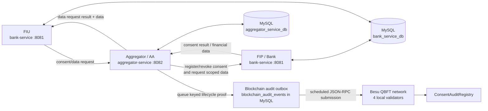

# Consent Chain

## 1. Project Overview

Consent Chain is a local reference implementation of consent-based financial data sharing among a Financial Information User (FIU), an Account Aggregator (AA), and a Financial Information Provider (FIP). The FIU requests financial information, the AA creates and manages customer consent through the existing CREATED/PENDING, APPROVED/ACTIVE, REJECTED, and REVOKED lifecycle, and the FIP independently checks its own consent artefact before releasing data. The two Spring Boot services persist application data in separate MySQL databases. A blockchain audit/proof layer has been added to the AA to asynchronously anchor keyed commitments for consent lifecycle events on a local Hyperledger Besu QBFT network. Blockchain is an audit layer only; it does not replace consent validation, authentication, MySQL persistence, or the existing AA/FIP data-sharing flow, and it stores no raw financial or personal data.

## 2. System Architecture


The existing image above documents the AA/FIP/FIU application flow. This Mermaid diagram extends it to show the current blockchain audit path. The bank-service process hosts both FIP and FIU modules.



The FIU-to-AA request handoff is made by the caller/client today; no server-side forwarding exists. The AA coordinates consent and data retrieval but does not own FIP financial records. The FIP independently checks its consent artefact before release and remains the final enforcement point. Blockchain submission is asynchronous and separate from the normal business-data flow.

## 3. Postman Endpoints to be Tested

### Base URLs and authentication

| Service | Base URL |
|---|---|
| AA | http://localhost:8082 |
| FIP and FIU (bank-service) | http://localhost:8081 |

Use Content-Type: application/json for JSON bodies. The current AA controllers do not enforce a Bearer token, and AA login does not issue a JWT. FIU routes have no custom API-key check. Protected FIP routes require X-AA-Token set to the same shared value as FIP_AA_API_KEY / BANK_AA_API_KEY. The AA supplies that header on its FIP calls. All statuses below describe successful current controller paths; validation/downstream errors can return 400, 401, 403, or 404.

### Recommended Postman order

Use synthetic AA user details and the PAN/account number from the local bank seed data. Save the returned userId and requestId for later requests.

#### 1. Register an AA user

- **Method and URL:** POST http://localhost:8082/aa/auth/register
- **Headers/auth:** Content-Type: application/json; no token.
- **Body:**
  ```json
  {
    "name": "Demo User",
    "email": "demo@example.test",
    "username": "demo-user",
    "password": "<SYNTHETIC_TEST_PASSWORD>",
    "mobile": "0000000000",
    "panNumber": "DEMO-PAN-001"
  }
  ```
- **Expected:** 200; User response with id for userId.
- **Database:** inserts aa_users row and audit_logs registration entry.
- **Blockchain:** none.

#### 2. Log in to the AA

- **Method and URL:** POST http://localhost:8082/aa/auth/login
- **Headers/auth:** Content-Type: application/json; no token.
- **Body:** `{"username":"demo-user","password":"<SYNTHETIC_TEST_PASSWORD>"}`
- **Expected:** 200; fields include success, userId, username, role. No JWT is returned.
- **Database:** reads aa_users and inserts audit_logs login entry.
- **Blockchain:** none.

#### 3. Create the FIU data request

- **Method and URL:** POST http://localhost:8081/fiu/data-request
- **Headers/auth:** Content-Type: application/json; no API key.
- **Body:**
  ```json
  {
    "customerPan": "<PAN_FOR_LOCAL_SEED_CUSTOMER>",
    "purpose": "Loan assessment",
    "dataScope": "ACCOUNT,TRANSACTIONS",
    "fromDate": "2026-01-01",
    "toDate": "2026-06-30"
  }
  ```
- **Expected:** 201; save generated requestId; response includes requestId and status CONSENT_REQUIRED.
- **Database:** inserts a bank-service data_requests row.
- **Blockchain:** none.

#### 4. Create the matching AA request and consent

- **Method and URL:** POST http://localhost:8082/aa/data-requests
- **Headers/auth:** Content-Type: application/json; no AA token.
- **Body:** substitute FIU requestId and AA userId.
  ```json
  {
    "requestId": "REQ-<FIU-GENERATED-ID>",
    "userId": 1,
    "fiuId": "DEMO-LENDER",
    "purpose": "Loan assessment",
    "dataScopes": ["ACCOUNT", "TRANSACTIONS"],
    "fromDate": "2026-01-01",
    "toDate": "2026-06-30"
  }
  ```
- **Expected:** 201; save consentId; fields include requestId, consentId, status PENDING_CONSENT, purpose, and dataScopes.
- **Database:** inserts consents and consent_data_scopes, aa_data_requests, and audit_logs entry.
- **Blockchain:** queues CREATED as PENDING in blockchain_audit_events; worker submits asynchronously.

#### 5. (Optional) Read the AA request

- **Method and URL:** GET http://localhost:8082/aa/data-requests/{requestId}
- **Headers/auth/body:** none.
- **Expected:** 200 with requestId, consentId, status, purpose, dataScopes, and dates.
- **Database:** reads aa_data_requests. **Blockchain:** none.

#### 6. Approve the consent

- **Method and URL:** PUT http://localhost:8082/aa/consents/{consentId}/approve
- **Headers/auth/body:** no body and no AA token; AA sends X-AA-Token to FIP internally.
- **Expected:** 200 with consent status ACTIVE. FIP failure returns 400 and leaves AA consent PENDING.
- **Database:** FIP first persists ACTIVE consent_artefacts; on success AA updates consents to ACTIVE and aa_data_requests to CONSENT_APPROVED and adds audit_logs entry.
- **Blockchain:** queues APPROVED after FIP registration succeeds and AA state is saved.

#### 7. Execute the approved data request

- **Method and URL:** POST http://localhost:8082/aa/data-requests/{requestId}/execute?accountNumber={SEEDED_ACCOUNT_NUMBER}
- **Headers/auth/body:** no body or AA token; AA supplies X-AA-Token to FIP.
- **Expected:** 200 with requestId, consentId, purpose, dataScopes, status DATA_RECEIVED, and returned scoped data. A non-approved request returns 400.
- **Database:** AA updates aa_data_requests through DATA_REQUESTED to DATA_RECEIVED. FIP reads consent_artefacts and requested account/transaction/loan tables. AA posts result to FIU; FIU updates its data_requests status, consentId, and response_data.
- **Blockchain:** no data-access event is written.

#### 8. Check the FIU result

- **Method and URL:** GET http://localhost:8081/fiu/data-request/{requestId}
- **Headers/auth/body:** none.
- **Expected:** 200 with requestId, consentId, status, and responseData.
- **Database:** reads bank-service data_requests. **Blockchain:** none.

#### 9. Retrieve the AA blockchain audit record

Wait for the worker (default poll delay 5 seconds) and transaction inclusion.

- **Method and URL:** GET http://localhost:8082/aa/consents/{consentId}/blockchain-audit
- **Headers/auth/body:** none.
- **Expected:** 200 array with eventType, status, recordedAt, transactionHash, verifiedOnChain, and message. SUBMITTED does not by itself mean verified.
- **Database:** reads blockchain_audit_events.
- **Blockchain:** checks the deployed contract record and compares type, reference, commitment, and recomputed local proof. Inspect verifiedOnChain.

#### 10. Revoke the active consent

- **Method and URL:** PUT http://localhost:8082/aa/consents/{consentId}/revoke
- **Headers/auth/body:** no body or AA token; AA calls FIP with X-AA-Token.
- **Expected:** 200 with status REVOKED. If FIP revoke fails, AA returns 400 and stays ACTIVE.
- **Database:** FIP marks consent_artefacts REVOKED first; AA then updates consents to REVOKED, linked aa_data_requests to REJECTED, and audit_logs.
- **Blockchain:** queues REVOKED after successful FIP and AA state changes.

#### 11. Test rejection using a separate consent

Create a second consent directly, then reject its generated consentId.

- **Create:** POST http://localhost:8082/aa/consents
- **Headers/auth:** Content-Type: application/json; no AA token.
- **Body:**
  ```json
  {
    "requestId": "REQ-REJECT-001",
    "userId": 1,
    "fiuId": "DEMO-LENDER",
    "purpose": "Loan assessment",
    "dataScopes": ["ACCOUNT"],
    "fromDate": "2026-01-01",
    "toDate": "2026-06-30"
  }
  ```
- **Create expected:** 201; response includes consentId and PENDING status. Inserts consents, consent_data_scopes and audit_logs; queues CREATED.
- **Reject:** PUT http://localhost:8082/aa/consents/{consentId}/reject; no body/token.
- **Reject expected:** 200 with REJECTED status; updates AA consent, related AA request if present, and audit_logs; queues REJECTED. FIP is not called, and FIU request row is not automatically updated by this direct route.

### Other relevant current endpoints

| Method and URL | Header/body/auth | Expected response and effect |
|---|---|---|
| GET http://localhost:8082/aa/consents/user/{userId} | None | 200; reads user's consents; no chain event. |
| GET http://localhost:8082/aa/consents/{consentId} | None | 200 if found; reads consent. |
| POST http://localhost:8081/fip/consents | X-AA-Token, JSON body below | 201; persists ACTIVE FIP artefact. Normally called by AA approval; no direct chain write. |
| PUT http://localhost:8081/fip/consents/{consentId}/revoke | X-AA-Token, no body | 200; marks FIP artefact REVOKED. Normally called by AA; no direct chain write. |
| POST http://localhost:8081/fip/data/account?accountNumber={number}&consentId={id} | X-AA-Token, no body | 200 if FIP consent valid; otherwise 403. Reads FIP data; no chain event. |
| POST http://localhost:8081/fip/data/transactions?accountNumber={number}&consentId={id}&fromDate=2026-01-01&toDate=2026-06-30 | X-AA-Token, no body | 200 if valid; otherwise 403. Reads transactions; no chain event. |
| POST http://localhost:8081/fip/data/loans?accountNumber={number}&consentId={id} | X-AA-Token, no body | 200 if valid; otherwise 403. Reads loan history; no chain event. |
| POST http://localhost:8081/fiu/data-request/{requestId}/result | Content-Type JSON, no API key, body below | 200; updates FIU request status and optional consentId/response_data. Normally called by AA. |
| GET http://localhost:8081/bank/health-check | None | 200 health text; no database change. |
| GET http://localhost:8082/aa/accounts/{userId} | None | 200; reads linked_bank_accounts. |
| POST http://localhost:8082/aa/data/account?accountNumber={number}&consentId={id} | No body | 200 if downstream succeeds; AA invokes FIP. Similar AA routes exist for /aa/data/transactions and /aa/data/loans with matching query params. |
| GET http://localhost:8082/aa/admin/users, /accounts, /consents, /audit-logs | None | 200 reads corresponding AA records. Current admin controller has no role guard. |

Direct FIP consent body:
```json
{
  "consentId": "CONSENT-EXAMPLE",
  "purpose": "Loan assessment",
  "dataScope": "ACCOUNT,TRANSACTIONS",
  "validTill": "2026-11-02T12:00:00"
}
```

Direct FIU result body:
```json
{
  "consentId": "CONSENT-EXAMPLE",
  "status": "DATA_RECEIVED",
  "data": {
    "example": "synthetic test data"
  }
}
```

## 4. Technical Requirements / Prerequisites

| Requirement | Repository-aligned version/setup | Why |
|---|---|---|
| Windows | Windows 10/11 with PowerShell for supplied local instructions | Host platform for this demo. |
| Docker Desktop | Docker Compose v2 and Linux containers | Runs four local Besu validators; no paid service/cloud account. |
| WSL 2 | Enable Docker Desktop WSL 2 integration; Ubuntu optional | Docker Desktop's Linux container engine uses WSL 2. Not needed to run Java directly. |
| Java / JDK | 21 (both POMs) | Builds and runs both Spring Boot services. |
| Maven | Module Maven Wrapper included; system Maven optional | Spring Boot build/run. On Windows invoke mvnw.cmd. |
| Node.js / npm | Node.js 20+ per blockchain setup | Installs and runs local Hardhat deployment and contract tooling. |
| MySQL | MySQL 8 compatible local server | Separate bank_service_db and aggregator_service_db persistence. |
| Git | Current Git for Windows | Clone and branch management. |
| IntelliJ IDEA or equivalent | Optional Java IDE | Configure service environment and run/debug. |
| Postman | Optional | Exercise local REST APIs. |
| Besu | Docker image hyperledger/besu:24.12.2 | Local QBFT nodes. |
| Hardhat / Solidity | Hardhat 2.22.17, Solidity 0.8.24, ethers 6.13.4 | Compile, test, and deploy ConsentAuditRegistry; versions are in blockchain/package.json and hardhat config. |

Run bank-service (FIP + FIU) locally on port 8081, aggregator-service (AA) on port 8082, MySQL locally for both databases, and Besu validators in Docker. Hardhat runs locally from blockchain and deploys through http://localhost:8545. Load/create the schemas using docs/databaseScripts; JPA ddl-auto:update also creates/updates entity tables at startup. Follow docs/blockchain-setup.md for the Windows commands.

## 5. Environment Variables

Set service variables in each process environment or IntelliJ Run Configuration. All secret entries below are placeholders.

### Aggregator / AA

| Variable | Value / purpose |
|---|---|
| SPRING_DATASOURCE_URL | jdbc:mysql://localhost:3306/aggregator_service_db |
| SPRING_DATASOURCE_USERNAME | <YOUR_MYSQL_USERNAME> |
| SPRING_DATASOURCE_PASSWORD | <YOUR_MYSQL_PASSWORD> |
| FIP_BASE_URL | http://localhost:8081 |
| FIP_AA_API_KEY | <YOUR_SHARED_AA_API_KEY>; must match BANK_AA_API_KEY |
| FIU_BASE_URL | http://localhost:8081; FiuClientService uses this for FIU result callbacks |

### Bank service (FIP + FIU)

| Variable | Value / purpose |
|---|---|
| SPRING_DATASOURCE_URL | jdbc:mysql://localhost:3306/bank_service_db |
| SPRING_DATASOURCE_USERNAME | <YOUR_MYSQL_USERNAME> |
| SPRING_DATASOURCE_PASSWORD | <YOUR_MYSQL_PASSWORD> |
| BANK_AA_API_KEY | <YOUR_SHARED_AA_API_KEY>; expected X-AA-Token value, same as FIP_AA_API_KEY |

### Blockchain (Aggregator / AA only)

| Variable | Value / purpose |
|---|---|
| BLOCKCHAIN_ENABLED | true to enable; default false |
| BLOCKCHAIN_RPC_URL | http://localhost:8545; default shown |
| BLOCKCHAIN_CHAIN_ID | 1337; local default |
| BLOCKCHAIN_CONTRACT_ADDRESS | <DEPLOYED_CONTRACT_ADDRESS> |
| BLOCKCHAIN_PRIVATE_KEY | <LOCAL_DEMO_PRIVATE_KEY>; must be the contract writer key; local demo only |
| BLOCKCHAIN_AUDIT_HMAC_SECRET | <YOUR_HMAC_SECRET_OF_AT_LEAST_32_CHARACTERS>; required when enabled |
| BLOCKCHAIN_POLL_DELAY_MS | Optional, default 5000 milliseconds |
| BLOCKCHAIN_GAS_PRICE_WEI | Optional, default 1000000000 |
| BLOCKCHAIN_GAS_LIMIT | Optional, default 300000 |

Hardhat deployment also reads DEPLOYER_PRIVATE_KEY. Its RPC and chain ID use BLOCKCHAIN_RPC_URL and BLOCKCHAIN_CHAIN_ID. Never place real passwords, private keys, or the HMAC secret in README/source control. The HMAC secret must remain unchanged to verify existing audit records; it cannot be recovered from commitments.

## 6. Core Logic

### Application logic

The FIU creates a request in bank-service, then the caller sends its requestId and request fields to the AA. The AA creates a PENDING consent and PENDING_CONSENT request in MySQL. Approval calls FIP registration first with X-AA-Token; only after FIP success does AA mark its consent ACTIVE and associated request CONSENT_APPROVED. Rejection is an AA-side transition and does not call FIP. Revocation calls FIP first; after acceptance AA marks REVOKED. A FIP failure prevents the AA approval/revocation state change.

When executing a request, AA requires CONSENT_APPROVED and calls the FIP only for scopes recorded on the AA request. FIP data service independently checks that its consent artefact exists, is ACTIVE, and is unexpired before returning data. AA saves DATA_RECEIVED and posts the result to the FIU; FIU stores response status and serialized response data. MySQL is the application source of truth. AuditService records AA user/account/consent actions.

Authentication is as implemented: AA register/login routes exist but controllers do not enforce a Bearer/JWT token, and login does not issue one. The FIP API-key filter requires X-AA-Token on protected FIP consent/data routes. FIU endpoints have no custom API key. The API documentation here describes implementation behavior, not a production security recommendation.

### Blockchain outbox logic

1. A consent lifecycle event occurs: CREATED, APPROVED, REJECTED, or REVOKED.
2. Existing consent/FIP work completes; ConsentService calls BlockchainAuditService.
3. BlockchainAuditService derives an opaque event key, opaque consent reference, and canonical keyed commitment using HMAC-SHA256. Raw consent/personal/financial content is not sent to Besu.
4. The event is persisted to blockchain_audit_events in MySQL as PENDING.
5. A scheduled worker scans up to 50 PENDING or FAILED events in creation order and submits them to Besu.
6. Successful submission stores the transaction hash and marks the row SUBMITTED. A caught runtime failure marks it FAILED and the worker retries it later.
7. The audit endpoint recomputes the local proof and compares it to the contract record.
8. Submission is asynchronous; normal consent/data operations do not wait for Besu. If blockchain is disabled, no outbox event is queued.

## 7. Core Workflow

### Consent Created

```text
FIU → caller creates matching AA request → AA saves consent/request in MySQL
    → BlockchainAuditService → MySQL outbox → scheduled submit → Besu
```

CREATED proves the AA recorded a request, not that the user approved it.

### Consent Approved

```text
User/caller → AA approve → FIP registration using X-AA-Token
            → FIP MySQL ACTIVE artefact → AA MySQL ACTIVE
            → MySQL outbox APPROVED → Besu
```

If FIP registration fails, AA stays PENDING and APPROVED is not queued.

### Consent Rejected

```text
User/caller → AA reject → AA MySQL REJECTED + linked AA request REJECTED
                         → audit_logs → outbox REJECTED → Besu
```

FIP is not called. The separate FIU request row is not automatically updated by the direct AA rejection endpoint.

### Consent Revoked

```text
User/caller → AA revoke → FIP revoke using X-AA-Token
                         → FIP MySQL REVOKED → AA MySQL REVOKED
                         → outbox REVOKED → Besu
```

If FIP revoke fails, AA remains ACTIVE and REVOKED is not queued.

### Financial Data Access

```text
Caller → AA executes approved request
       → FIP independently checks its ACTIVE, unexpired consent artefact
       → FIP returns requested data → AA stores DATA_RECEIVED
       → AA posts result to FIU → FIU persists response
```

Business flow controls consent and data release. Blockchain flow records lifecycle proofs only; financial data access itself emits no chain event. Besu downtime delays proof submission/retry and does not replace AA or FIP consent checks.

## 8. Blockchain — Detailed Logic

### Why blockchain?

Besu is an append-only proof layer that lets the application check whether a keyed consent lifecycle record was anchored. MySQL remains the operational store. The blockchain does not authorize FIP release or determine consent validity.

### What is stored on-chain?

ConsentAuditRegistry stores bytes32 values: an HMAC-derived event key; an HMAC-derived opaque consent reference; a keyed commitment hash; event type; and a contract-recorded block timestamp. Raw consent ID, purpose, scopes, dates, customer name, PAN, account numbers, credentials, and financial data are not submitted.

### HMAC commitments

BlockchainAuditService creates a versioned canonical representation using length-prefixed fields: consent-audit-v1, consent ID, event type, FIU ID, purpose, sorted scopes, from/to dates, consent expiry, and the event timestamp truncated to microseconds. HMAC-SHA256 with BLOCKCHAIN_AUDIT_HMAC_SECRET derives the event key, consent reference, and commitment hash. The raw canonical representation and secret stay off-chain. Preserve the same HMAC secret to recompute proofs for existing records.

### Event types

| Event | Meaning | Contract value |
|---|---|---:|
| CREATED | Consent request created as PENDING | 0 |
| APPROVED | FIP registration succeeded; AA saved ACTIVE | 1 |
| REJECTED | AA changed pending consent to REJECTED | 2 |
| REVOKED | FIP revoke succeeded; AA saved REVOKED | 3 |

No consent modification flow/event is implemented.

### DB Outbox

```text
ConsentService → BlockchainAuditService → BlockchainAuditEvent (MySQL)
              → scheduled submission → Besu JSON-RPC
```

The MySQL outbox stores event type, event key, consent reference, commitment hash, local timestamp, status, transaction hash, and failure metadata. The worker polls at BLOCKCHAIN_POLL_DELAY_MS (default 5000 ms), handles up to 50 eligible rows per poll, and retries FAILED rows.

### Besu and contract

Hyperledger Besu is an Ethereum-compatible client. The local development network is a four-validator QBFT network in Docker, with chain ID 1337 and JSON-RPC at http://localhost:8545. No paid cloud or external chain provider is required.

blockchain/contracts/ConsentAuditRegistry.sol has a writer-only recordEvent function, rejects invalid event codes/empty fields/duplicate keys, exposes hasEvent and getAuditRecord, and emits ConsentAuditRecorded. The Hardhat deployer is set as the only writer, so the AA signing key must match the deployment writer key.

### Deployment

1. Start the local four-validator Besu network under blockchain/besu using Docker Compose.
2. Check its JSON-RPC endpoint and chain ID.
3. From blockchain, run npm install and npm run deploy:besu with BLOCKCHAIN_RPC_URL, BLOCKCHAIN_CHAIN_ID, and DEPLOYER_PRIVATE_KEY set.
4. Copy the printed contract address to BLOCKCHAIN_CONTRACT_ADDRESS in the AA environment.
5. Set the matching local writer key, stable HMAC secret, and other AA variables.
6. Start the existing bank-service and aggregator-service.

Use docs/blockchain-setup.md for exact PowerShell setup commands. The funded Hardhat key included in this local demo is publicly known; use it only on the isolated local chain, never a public/production network.

### Verification

The AA audit endpoint recomputes the expected event key, consent reference, and local HMAC commitment; checks that the event key exists in the contract; and compares event type, consent reference, and commitment hash against the contract record. verifiedOnChain is true only when all local and on-chain comparisons match. A SUBMITTED transaction is not sufficient by itself. API recordedAt is the outbox creation time; the contract separately stores a block timestamp.

### Failure and retry behavior

- Besu unavailable: event remains locally queued; submission failure is marked FAILED and retried by the scheduled worker.
- Submission succeeds: transaction hash is saved and outbox status becomes SUBMITTED.
- Submission fails: failure details are stored and the worker retries FAILED rows.
- Verification fails: verifiedOnChain is false with a mismatch or pending/finality message; consent state and data access are not changed.
- Blockchain disabled: no audit event is queued; existing consent and data behavior stays in use.

### Security

Sensitive data stays in the existing app/MySQL flow. The chain gets opaque HMAC-derived commitments/references and lifecycle type only. Protect BLOCKCHAIN_PRIVATE_KEY and BLOCKCHAIN_AUDIT_HMAC_SECRET; never commit or disclose them. The local demo signing key is not safe for a public or production chain.

### What is Remaining

#### Already completed

- Existing FIP/FIU/AA consent lifecycle and MySQL persistence.
- AA blockchain outbox, HMAC commitment generation, asynchronous Besu submit/retry, and audit endpoint.
- ConsentAuditRegistry and local Besu QBFT/Hardhat setup.
- A local demo exercised CREATED, APPROVED, REJECTED, and REVOKED; several records were verified on-chain.

#### Remaining / Known Issues

- In the live verification reported for this project, the first consent's CREATED event returned verifiedOnChain: false because its local commitment did not match. Do not claim every event verified; resolve this mismatch and verify each event.
- Fresh four-validator starts may need peer hostname/IP configuration correction when Docker assigns different validator IPs; check validators and JSON-RPC after setup.
- The local npm/Hardhat dependency audit reported vulnerabilities; review these before production use.
- Consent-artifact PDF/image standardization is future work and is not implemented in the current repository.
