# ConsentChain

A blockchain-based reference implementation of RBI's **Account Aggregator (AA) framework** for secure, consent-driven financial data sharing.

ConsentChain demonstrates how a customer can authorize a Financial Information User (FIU) to access financial information held by one or more Financial Information Providers (FIPs) through an Account Aggregator. The project focuses on **consent management, secure data sharing, revocation, and tamper-evident audit logging**.

> 📋 Detailed build history and today's session log: [docs/readmeFiles/CHANGELOG.md](docs/readmeFiles/CHANGELOG.md)

---

## Table of Contents

- [Current Status](#current-status)
- [Project Overview](#project-overview)
- [FIP / FIU Role Logic](#fip--fiu-role-logic)
- [End-to-End System Flow](#end-to-end-system-flow)
- [Consent Lifecycle](#consent-lifecycle)
- [Example: Complete Loan Data Flow](#example-complete-loan-data-flow)
- [Project Structure](#project-structure)
- [Team & Responsibilities](#team--responsibilities)
- [Technology Stack](#technology-stack)
- [Environment Variables](#environment-variables)
- [Database Specification & Decisions](#database-specification--decisions)
- [Bank/FIP Data Model](#bankfip-data-model)
- [Bank Service Consent Model](#bank-service-consent-model)
- [Aggregator Service — Responsibilities](#aggregator-service--responsibilities)
- [Blockchain / Hash-Chain Audit](#blockchain--hash-chain-audit)
- [Revocation Flow](#revocation-flow)
- [Frontend Page Structure](#frontend-page-structure)
- [Bank Simulation Options](#bank-simulation-options)
- [Service Communication](#service-communication)
- [Security](#security)
- [Authentication Strategy — Why JWT Only in Aggregator-Service](#authentication-strategy--why-jwt-only-in-aggregator-service)
- [Bank Service API Contracts (with examples)](#bank-service-api-contracts-with-examples)
- [Data Sharing Security Simulation](#data-sharing-security-simulation)
- [System Flow](#system-flow)
- [What Each Developer Should Focus On](#what-each-developer-should-focus-on)
- [What We Are NOT Building](#what-we-are-not-building)
- [Key Design Principle](#key-design-principle)
- [Learning Goals](#learning-goals)
- [Development Guidelines](#development-guidelines)
- [How to Run](#how-to-run)
- [Final Architecture](#final-architecture)
- [Final Project Story](#final-project-story)

---

## Current Status

| Module | Status | Notes |
|---|---|---|
| `bank-service` | ✅ **Complete** | All FIP-simulation APIs implemented, tested end-to-end in Postman, MySQL-backed, API-key protected, BCrypt auth |
| `aggregator-service` | 🔧 **In progress** | Schema + seed data done; application code (entities, repositories, services, controllers, JWT auth, consent brokering, hash-chain audit) is the current focus |
| `frontend-consent-dashboard` | ⏳ **Not started** | Owned by frontend teammate |

Next up: `ConsentArtefact` model + consent creation API in `aggregator-service`. Full task list in [docs/readmeFiles/CHANGELOG.md](docs/readmeFiles/CHANGELOG.md#whats-next).

---

## Authentication Strategy — Why JWT Only in Aggregator-Service

A deliberate decision was made to **not** implement JWT in `bank-service`, and instead keep its security minimal while concentrating full JWT-based authentication in `aggregator-service`. Reasoning:

- **`bank-service` is only an FIP simulation.** In the real system, a bank authenticates its own customers directly (already covered by the simple `/auth/login` here) — but requests *from the AA* only need a lightweight check that they're coming from a trusted aggregator, not a full identity/session system.
- **A simple API key (`X-AA-Token`) is sufficient** for that trust check — a static token the AA service sends with every request, verified by a small filter in `bank-service`. This is a ~10-line filter versus the ~100+ lines a proper JWT setup (signing key, expiry validation, refresh logic) would need.
- **JWT belongs in `aggregator-service`** — that's where customers actually log in, sessions need to persist across a multi-step consent flow, and role-based access (separate FIP and FIU dashboards, described below) needs enforcing. That complexity justifies JWT; `bank-service` has none of it.

**Verdict:** `bank-service` → simple API key. `aggregator-service` → JWT (to be built alongside its Auth module).

---

## Frontend — Role-Based Ports (FIP vs FIU)

Following the same reasoning used for an admin/user split in a typical app, the frontend serves **FIP and FIU as separate role-based experiences**, each pointing at its own set of endpoints on the shared `aggregator-service` backend (see the FIP/FIU role logic section below — an institution's role is per-request, not fixed, but each *frontend* still needs a distinct entry point):

- `frontend-consent-dashboard/fip/*` — FIP-side pages (Login, Dashboard, Data Requests, Request Details, Provide Authorized Data, Request History), calling `/fip/**` endpoints
- `frontend-consent-dashboard/fiu/*` — FIU-side pages (Login, Dashboard, Create Data Request, My Requests, Received Data, Request History), calling `/fiu/**` endpoints

Both frontends talk to the **same aggregator-service backend** — the split is only at the frontend routing/UI level, exactly like separating an admin panel from a user-facing app while both hit one backend. This avoids duplicating backend logic while still giving each role a focused, uncluttered UI.

---

## Bank Service API Contracts (with examples)

Base URL: `http://localhost:8081/bank`

All protected endpoints require the header `X-AA-Token: <AA_API_KEY>` (see [Environment Variables](#environment-variables)).

**1. Health Check**

`GET /bank/health-check` → `200 OK` — `Bank service is up`

**2. Validate Consent**

`POST /bank/validate-consent`

Request:
```json
{ "consentId": "consent-abc-123" }
```

Response — Valid (`200 OK`):
```json
{ "valid": true, "message": "Consent is valid" }
```

Response — Invalid/Expired (`400 Bad Request`):
```json
{ "valid": false, "message": "Consent is expired or revoked" }
```

Response — Not Found (`404 Not Found`):
```json
{ "valid": false, "message": "Consent not found" }
```

**3. Fetch Data**

`POST /bank/fetch-data?accountNumber=SBIN0001234&consentId=consent-abc-123` (query params, no request body)

Response — Success (`200 OK`):
```json
{ "encodedData": "eyJhY2NvdW50TnVtYmVyIjoi..." }
```
`encodedData` is a Base64-encoded JSON string containing `accountNumber`, `holderName`, `balance`, `ifscCode`. Decode it to read the actual data.

Response — Consent Invalid (`403 Forbidden`):
```json
{ "valid": false, "message": "Consent invalid, data not shared" }
```

Response — Account/Consent Not Found (`500`): currently a generic error — will be improved with custom exception handling.

**Status codes summary**

| Code | Meaning |
|---|---|
| 200 | Success |
| 400 | Consent expired/revoked |
| 403 | Consent invalid — data not shared |
| 404 | Consent not found |
| 500 | Account not found (temporary — needs proper exception handling) |

**Full `bank-service` endpoint list**

| Endpoint | Method | Protected by `X-AA-Token`? | Purpose |
|---|---|---|---|
| `/bank/health-check` | GET | No | Liveness check |
| `/auth/register` | POST | No | Register a bank-service user (password BCrypt-hashed) |
| `/auth/login` | POST | No | Login (BCrypt-verified) |
| `/bank/validate-consent` | POST | Yes | Check a consent artefact is ACTIVE and not expired |
| `/bank/fetch-data` | POST | Yes | Return Base64-encoded account data if consent is valid |
| `/bank/fetch-statement` | POST | Yes | Return transactions for an account (optional date range) |
| `/bank/loan-history/{accountNumber}` | GET | Yes | Return loan history for an account |

> `/bank/fetch-statement` and `/bank/loan-history/{accountNumber}` are implemented and tested — their request/response contracts will be added here once finalized.

---

## Data Sharing Security Simulation

For the initial implementation, `bank-service` uses **Base64 encoding** to simulate encoded data transfer.

> Base64 is encoding, not encryption. It is used here only as a development/demo simulation. A production implementation would require proper encryption and secure key management.

---

## System Flow


*Complete page-flow diagram — Customer/AA interface, FIU interface, and FIP interface across the full consent lifecycle.*

---

## Project Overview

ConsentChain simulates an Account Aggregator ecosystem with three major roles:

**Customer** — owner/controller of consent. Can create an account, connect financial accounts, view aggregated financial information, receive data-sharing requests, approve/deny consent, view active/expired/revoked consents, revoke consent, and view audit history.

**FIP (Financial Information Provider)** — the institution holding the requested data. In our simulation, a bank acts as an FIP (Bank A, Bank B, Bank C). Maintains customer details, accounts, balances, transactions. Provides data only when authorized by valid consent.

**FIU (Financial Information User)** — the institution requesting/using the data (e.g. a bank or fintech evaluating a loan application). Creates a data request specifying customer, purpose, required data, accounts, period, and consent validity.

**AA (Account Aggregator)** — the consent broker and orchestrator. Creates/manages consent artefacts, validates consent, routes requests between FIUs and FIPs, coordinates authorized data retrieval, handles revocation, and maintains a tamper-evident audit trail via a custom SHA-256 hash chain.

---

## FIP / FIU Role Logic

FIP and FIU are **roles in a particular data-sharing request**, not permanent identities. An institution can act as an FIP in one request and an FIU in another.


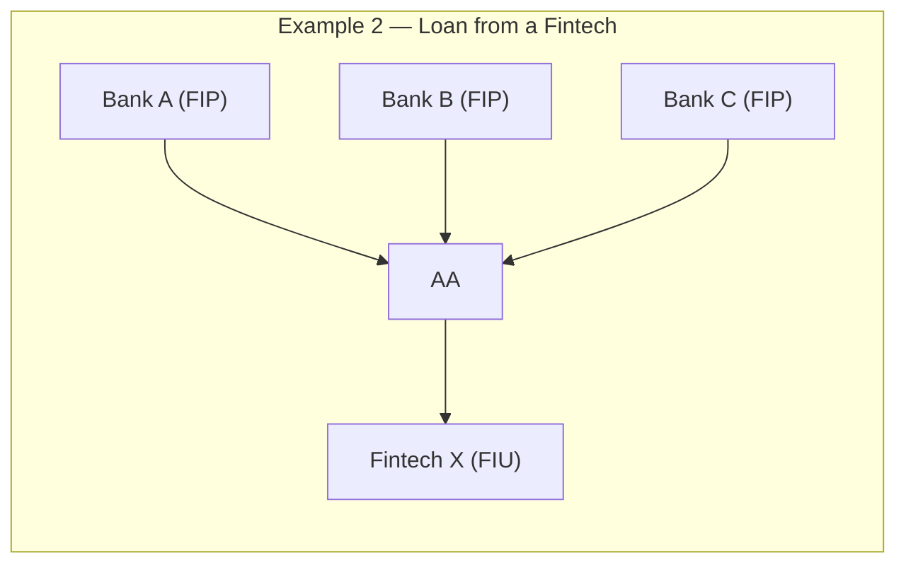

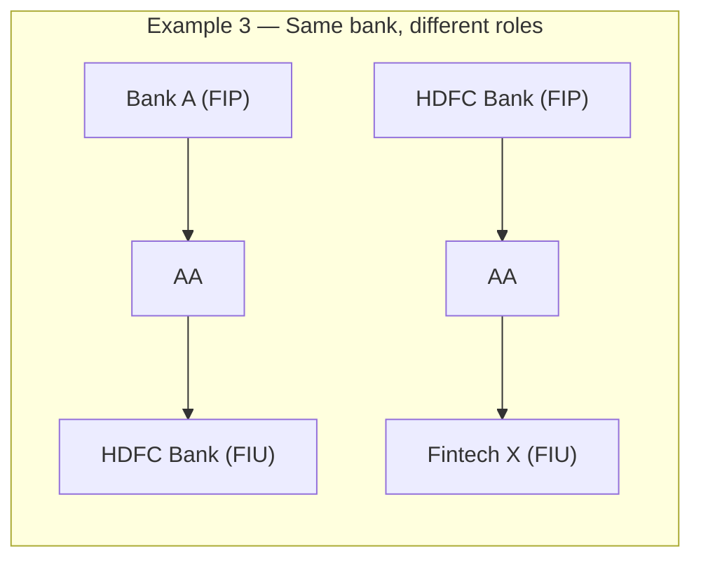

The system should **not permanently classify an institution as only FIP or only FIU** — the role is determined per request.

---

## End-to-End System Flow

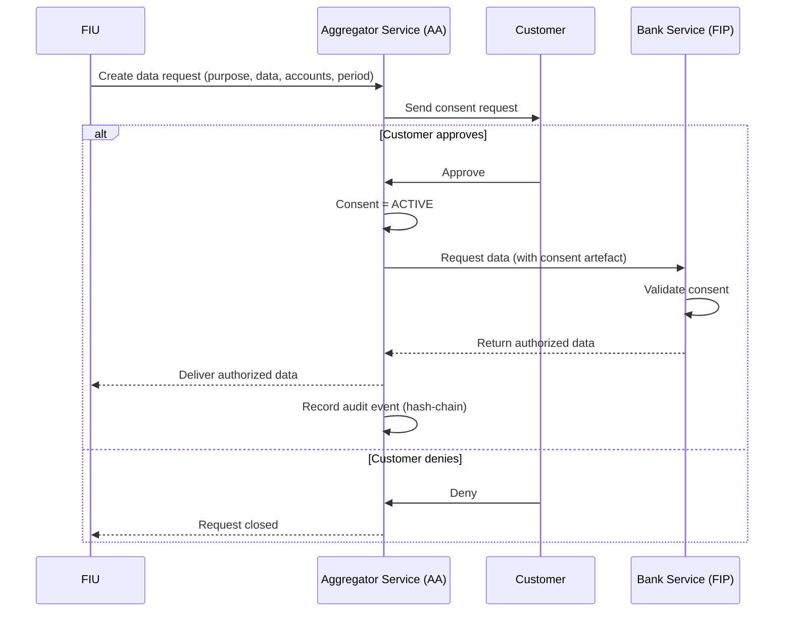

---

## Consent Lifecycle

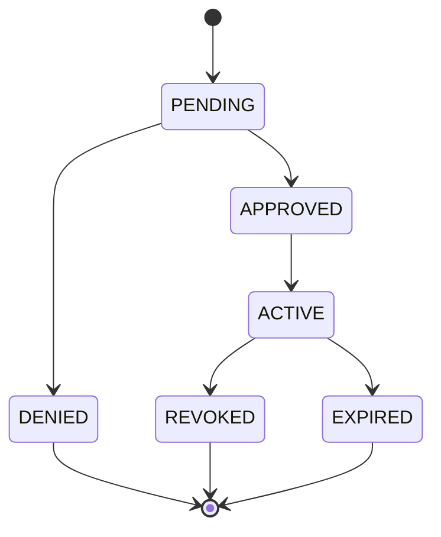

Supported states: `PENDING`, `ACTIVE`, `DENIED`, `REVOKED`, `EXPIRED`. The AA validates whether a consent is currently usable.

---

## Example: Complete Loan Data Flow

Customer = Sakshi | FIPs = Bank A, Bank B | FIU = HDFC Bank | Purpose = Loan Application | Data = Balance + Transactions | Period = Last 6 Months

1. FIU creates request (requester, providers, purpose, data, period)
2. AA creates a consent artefact and sends it to the customer
3. Customer reviews: who's requesting, why, what data, which accounts, for how long, validity
4. Customer approves → consent becomes `ACTIVE`
5. AA requests data from Bank A and Bank B; each FIP validates the consent first
6. FIPs return data to AA
7. AA routes authorized data to HDFC Bank
8. Audit event recorded in the hash-chain
9. Customer can later revoke → `ACTIVE → REVOKED`; further access is rejected

---

## Project Structure

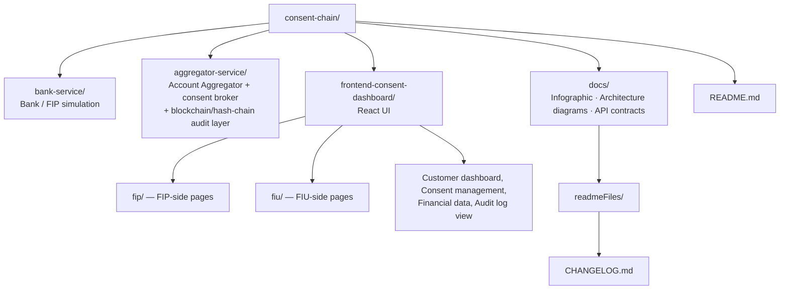

---

## Team & Responsibilities

| Member  | Module                       | Responsibility                                                                      |
|---------|-------------------------------|--------------------------------------------------------------------------------------|
| Sakshi + Bhunesh | `bank-service` (done) + `aggregator-service` (in progress) | Bank/FIP simulation — account data, consent validation, authorized data retrieval; and AA logic, consent broker, request routing, blockchain/hash-chain ledger, revocation |
| [Name]  | `frontend-consent-dashboard`  | React UI — dashboard, consent grant/view/revoke, financial data, audit log           |

**Why Sakshi and Bhunesh are pairing across both backend modules (not split):** `bank-service` and `aggregator-service` are tightly coupled — the aggregator directly calls the bank-service's endpoints, and the consent artefact structure has to match on both sides. Building both together avoids integration mismatches and means whoever builds the aggregator already deeply understands the FIP contract it's calling into. `bank-service` is now functionally complete; the same pairing continues into `aggregator-service`, which is the real, harder half of the project (consent brokering, routing, JWT auth, hash-chain audit).

---

## Technology Stack

**Backend:** Java 21, Spring Boot 3.3.4, Maven, Spring Web, Spring Data JPA, Lombok
**Database:** H2 (development/testing); MySQL for a persistent bank-service setup
**Frontend:** React
**Audit / Blockchain Layer:** Custom hash-chain, SHA-256, `MessageDigest`

---

## Environment Variables

Both services read credentials/secrets from environment variables instead of hardcoding them in `application.yml`. Each teammate should set these locally against **their own MySQL instance** — do not share DB credentials across machines.

| Variable | Used In | Purpose | Notes |
|---|---|---|---|
| `DB_USERNAME` | bank-service, aggregator-service | MySQL username | Use your own local MySQL user |
| `DB_PASSWORD` | bank-service, aggregator-service | MySQL password | Use your own local MySQL password |
| `AA_API_KEY` | bank-service, aggregator-service | Shared secret for the `X-AA-Token` header — aggregator-service sends it, bank-service's `ApiKeyFilter` verifies it | `AA_API_KEY=aa-secret-key-2026` (same value must be set on both services) |

> Each developer runs against their own local `bank_service_db` / `aggregator_service_db` — set up your own schema and seed data locally using the SQL scripts in `docs/`.

---

## Database Specification & Decisions

Both services run on **MySQL** (`bank_service_db` and `aggregator_service_db`), connected via Spring Data JPA with `ddl-auto: validate` — Hibernate checks entities against the existing hand-written schema at startup rather than auto-generating or altering tables, so the schema stays the single source of truth. Full SQL schema, seed data, and the consent artefact JSON structure are documented separately in `docs/ConsentChain_Database_Specification.docx`. Summary of the key decisions:

| Decision | Choice | Reason |
|---|---|---|
| Database engine | MySQL | Persistent storage so seeded/test data survives restarts; matches the relational nature of the core entities. |
| Schema management | Hand-written SQL + `ddl-auto: validate` | Schema is created explicitly via SQL scripts; Hibernate only validates entity mappings against it at startup, preventing accidental auto-migration from wiping or altering seeded data. |
| Data model style | Relational (SQL) + a JSON text column for consent artefacts | Core entities are naturally relational (foreign keys, joins). The consent artefact is nested/flexible, so it's serialised as JSON in a `TEXT` column rather than fully normalised — structured columns (`consent_id`, `status`, `valid_till`) stay outside the JSON for fast queries. |
| bank-service vs aggregator-service databases | Separate database per service (`bank_service_db`, `aggregator_service_db`) | Each module owns its schema so the two services can be developed/deployed independently. |
| Bank simulation (HDFC/SBI/ICICI) | Single `bank-service`, differentiated by a `bank_name` column | Simpler than running three separate instances; sufficient to demonstrate the FIP role across multiple banks. |
| Security layer split | JWT/API-key security concentrated in `aggregator-service`; `bank-service` kept intentionally simple | `bank-service` is a simulation of the FIP side only — the real system complexity (consent brokering, routing, audit) lives in the aggregator, so its security is kept minimal (basic auth, extended with a simple API-key check). |

**Table ownership**

| Table | Owning service | Purpose |
|---|---|---|
| `customers`, `accounts`, `transactions`, `loan_history` | bank-service | Simulated financial data |
| `consent_artefacts` (local) | bank-service | Lightweight consent validation at the FIP |
| `consent_artefacts` (master) | aggregator-service | Full consent record with JSON artefact + audit reference |
| `data_requests` | aggregator-service | FIU-originated requests and routing status |
| `institution_mapping` | aggregator-service | Links a customer (PAN) to accounts across banks |
| `institutions` | aggregator-service | Registry of FIPs/FIUs with status and API key |
| `audit_blocks` | aggregator-service | SHA-256 hash-chain audit trail |

---

## Bank/FIP Data Model

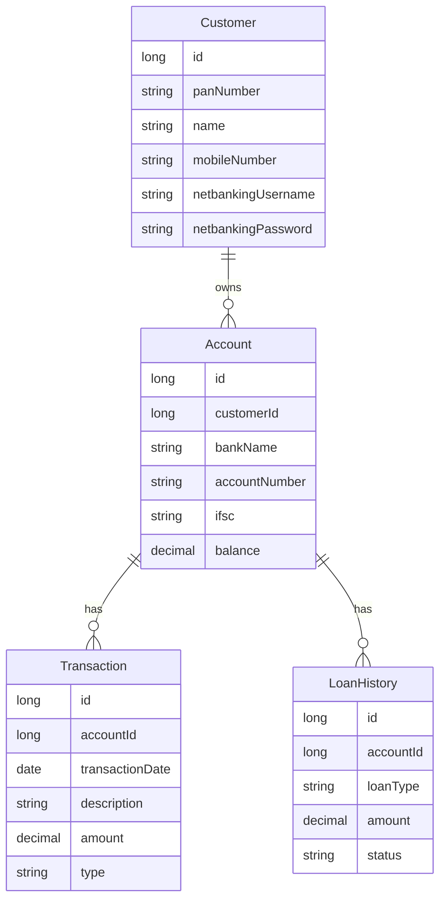

---

## Bank Service Consent Model

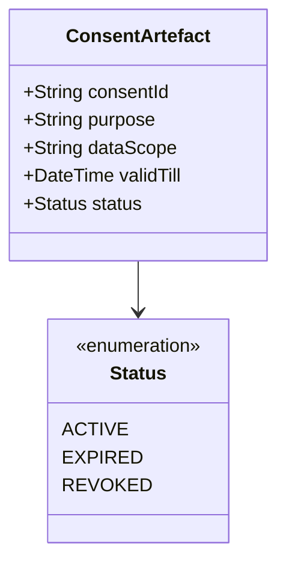

The aggregator maintains the broader consent lifecycle; the FIP validates whether the consent presented for a data request is usable.

---

## Aggregator Service — Responsibilities

1. **Consent Creation** — build a consent artefact from the FIU's data request
2. **Consent Management** — maintain states: `PENDING`, `ACTIVE`, `DENIED`, `REVOKED`, `EXPIRED`
3. **FIU Request Handling** — receive financial data requests
4. **FIP Identification** — determine which institution(s) hold the requested information
5. **Customer Consent** — send the request to the customer for approval/denial
6. **FIP Routing** — route the authorized request to relevant FIP service(s)
7. **Data Aggregation** — consolidate data from one or more FIPs for the FIU
8. **Revocation** — allow revocation and ensure revoked consent can't be reused
9. **Audit Trail** — record events in the SHA-256 hash-chain

### Dynamic FIP/FIU Request Model

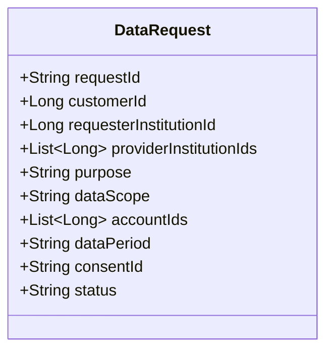

---

## Blockchain / Hash-Chain Audit

ConsentChain uses a custom hash-chain instead of a full external blockchain network.

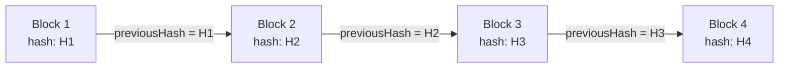

Each `AuditBlock` stores `data/event`, `timestamp`, `hash`, and `previousHash`. Changing an earlier record breaks the subsequent hash chain.

**Events to audit:** `CONSENT_CREATED`, `CONSENT_APPROVED`, `CONSENT_DENIED`, `DATA_REQUESTED`, `FIP_DATA_REQUESTED`, `DATA_RECEIVED`, `DATA_SHARED`, `CONSENT_REVOKED`, `CONSENT_EXPIRED`

---

## Revocation Flow

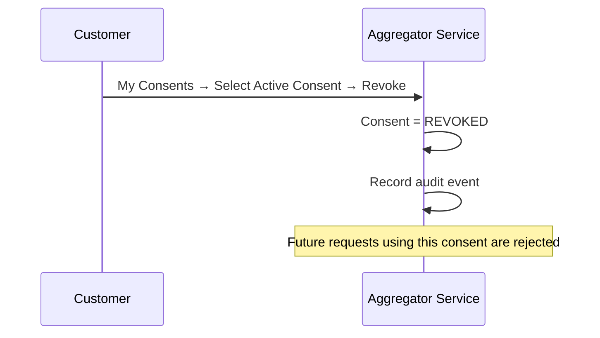

The aggregator-service also handles session/request invalidation where required.

---

## Frontend Page Structure

The frontend represents the **Customer/AA experience**, not a traditional banking app. The main dashboard is an **AA dashboard**, not a bank dashboard.

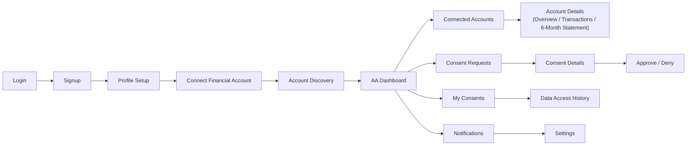

**FIU Interface**

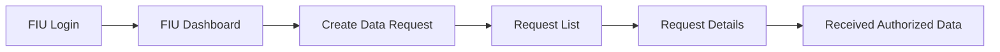

**FIP Interface**

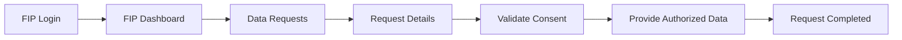

The FIP does not independently create the customer's consent — it validates the applicable authorization and provides the permitted information.

---

## Bank Simulation Options

**Option 1 — Single Service (recommended):** One `bank-service`, differentiated by a `bankName` field (`HDFC`, `SBI`, `ICICI`).
**Option 2 — Multiple Instances:** Same codebase run as separate instances — `Bank A → 8081`, `Bank B → 8082`, `Bank C → 8083`.

---

## Service Communication

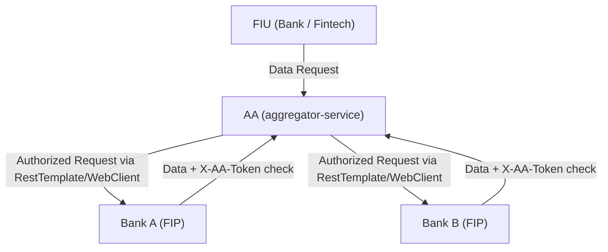

The aggregator-service uses `RestTemplate` or `WebClient` to communicate with the bank-service.

---

## Security

For development/testing, FIP APIs use a simple API key/token mechanism to ensure requests originate from the AA service.

```http
X-AA-Token: <AA_API_KEY>
```

See [Environment Variables](#environment-variables) for how this is configured. A production implementation would require stronger authentication, authorization, encryption, and secure key management.

---

## What Each Developer Should Focus On

**Sakshi & Bhunesh (paired) — Bank/FIP → Aggregator/AA:** Started together on `bank-service` (Customer, Account, Transaction, Loan History, Consent Validation, Fetch Data, FIP API Contract) — now complete — and continue paired into `aggregator-service` (FIU Request → Consent → Customer Approval → Consent Validation → FIP Routing → Data Aggregation → FIU Delivery → Audit Hash Chain → Revocation).
> Bank-service should answer: *"Is this request authorized, and if yes, what financial information am I allowed to provide?"*
> Aggregator-service should answer: *"Is there valid customer consent, which FIPs have the required data, what data is authorized, and where should the authorized data go?"*

**Frontend Developer:** Customer Dashboard, Accounts, Financial Data, Consent Requests, Consent Approval, Consent Management, Revocation, Access History — plus the separate FIP and FIU role-based views described above.

---

## What We Are NOT Building

ConsentChain is a reference/simulation project, not a complete banking application. We are **not** building a real bank, real UPI/payment processing, real money transfers, real loan disbursement, a production RBI AA implementation, a production banking authentication system, or a real blockchain network.

The bank-service is a simulated FIP, and the FIU is simulated by a bank or fintech. The purpose is to demonstrate the **consent-driven financial data-sharing architecture**.

---

## Key Design Principle

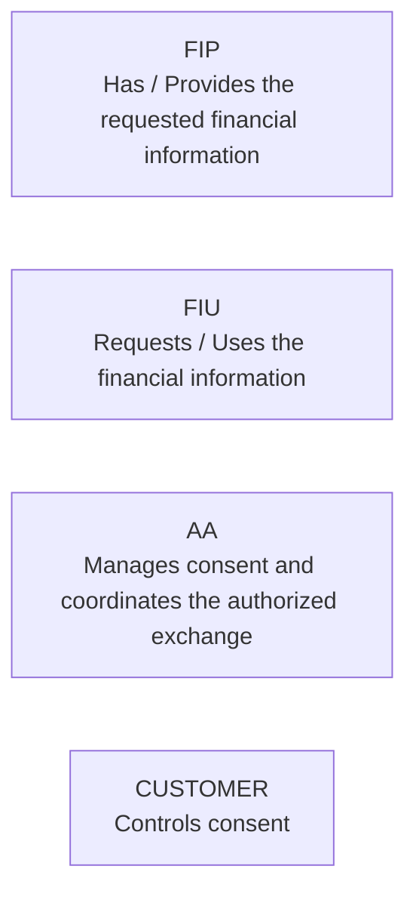

The FIP/FIU role is determined **per request**.

---

## Learning Goals

| Concept | Why it matters |
|---|---|
| Spring Boot | Backend service development |
| JPA Repository | Database access |
| REST APIs | Service-to-service communication |
| DTOs | API request/response structure |
| `ResponseEntity` | HTTP status handling |
| Exception Handling | Graceful API failures |
| Consent State Management | Core AA business logic |
| REST Service Integration | AA ↔ FIP communication |
| SHA-256 | Hash-chain implementation |
| Blockchain Concepts | Tamper-evident audit trail |
| React | Consent/dashboard UI |
| API Contracts | Parallel frontend/backend development |

---

## Development Guidelines

- Use **Java 21** consistently across all backend modules.
- Keep controllers thin and business logic inside services.
- Keep repository/database logic separate from controllers.
- Keep seed data separate from controllers (own file, e.g. `DataSeeder.java`).
- Follow endpoint naming conventions: `/bank/<action>`, `/aggregator/<action>`.
- Keep API contracts updated when request/response structures change.
- Commit small, working increments.
- Do not commit `.idea/` — it's in `.gitignore`.
- Use feature branches: `feature/<your-module>` → PR into `main` when ready.
- Set `DB_USERNAME`, `DB_PASSWORD`, and `AA_API_KEY` locally (see [Environment Variables](#environment-variables)) — use your own MySQL setup, don't share credentials.

---

## How to Run

**Bank Service**
```bash
cd bank-service
./mvnw spring-boot:run
```
`http://localhost:8081` | MySQL database: `bank_service_db` (`spring.datasource.url=jdbc:mysql://localhost:3306/bank_service_db`)

**Aggregator Service**
```bash
cd aggregator-service
./mvnw spring-boot:run
```
`http://localhost:8082` | MySQL database: `aggregator_service_db`

---

## Final Architecture

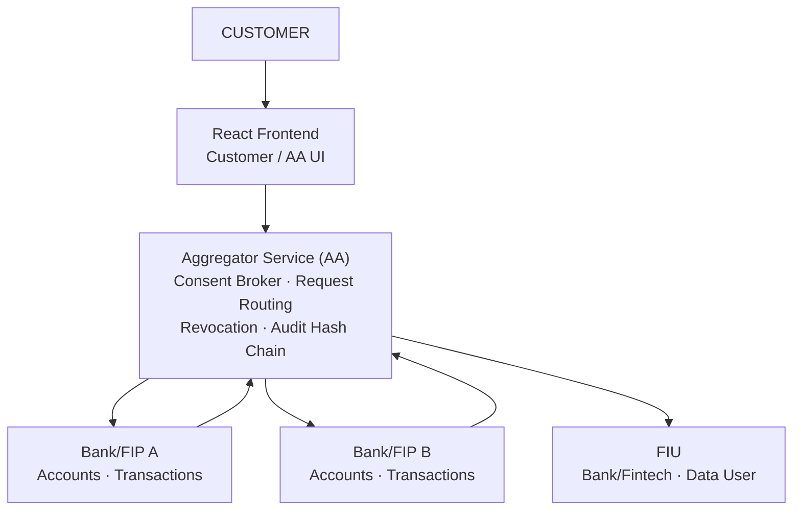

See also the full page-flow infographic: `docs/Account Aggregator System Flow Infographic.png` (referenced in the [System Flow](#system-flow) section above).

---

## Final Project Story

> A customer applies for a financial service such as a loan. The requesting institution (FIU) needs financial information held by one or more institutions (FIPs). Instead of directly sharing credentials or financial data, the request passes through the Account Aggregator. The customer reviews the purpose, requested data, accounts, period, and validity before giving consent. Once approved, the AA coordinates authorized data retrieval from the relevant FIPs and delivers the permitted information to the FIU. Every important consent and data-sharing event is recorded in the tamper-evident audit trail, and the customer can revoke consent later.

**Core flow:**

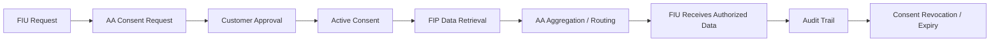