<div align="center">


# 🔗 ConsentChain

### A consent-first reference implementation of RBI's Account Aggregator (AA) framework

*Move financial data only when the customer says yes, only for the purpose they approved, and only until the consent expires or is revoked.*

<br/>


</div>

---

## 📑 Table of Contents

1. [Overview](#-overview)
2. [Key Features](#-key-features)
3. [Architecture](#-architecture)
4. [End-to-End Flows](#-end-to-end-flows)
5. [Lifecycles and State Machines](#-lifecycles-and-state-machines)
6. [Data Model](#-data-model)
7. [Service Internals](#-service-internals)
8. [API Reference](#-api-reference)
9. [Security Model](#-security-model)
10. [Audit Trail and Hash-Chain Ledger](#-audit-trail-and-hash-chain-ledger)
11. [Tech Stack](#-tech-stack)
12. [Getting Started](#-getting-started)
13. [Configuration](#-configuration)
14. [Repository Layout](#-repository-layout)
15. [Project Status and Roadmap](#-project-status-and-roadmap)

---

## 🌐 Overview

India's **Account Aggregator** framework, defined by the RBI, lets a customer share financial data between institutions through a regulated intermediary, using **explicit, purpose-bound, time-bound consent**. Three roles take part:

| Role | Full name | What it does | In ConsentChain |
|---|---|---|---|
| **FIP** | Financial Information Provider | Holds the data (a bank) and releases it only against a valid consent | `bank-service` → `/fip/*` and `/bank/*` |
| **FIU** | Financial Information User | Wants the data (a lender, for example) and asks the customer for it | `bank-service` → `/fiu/*` |
| **AA** | Account Aggregator | Neutral broker that manages consent and routes data without being the data owner | `aggregator-service` → `/aa/*` |

ConsentChain implements this three-party model end to end as two Spring Boot applications backed by MySQL: a customer registers with the AA, links a bank account, approves or rejects a consent request, and an FIU receives the data only after the consent is active. Revoking a consent propagates to the FIP, which then refuses further access.

> **Why "Chain"?** The project is designed around a tamper-evident, SHA-256 hash-chained audit ledger for consent events. The `audit_blocks` schema exists, and the current build records an append-only `audit_logs` trail. See [Audit Trail and Hash-Chain Ledger](#-audit-trail-and-hash-chain-ledger) for exactly what is live and what is planned.

---

## ✨ Key Features

- **Three-party AA model**: separate FIP, FIU and AA responsibilities with clean REST boundaries.
- **Full consent lifecycle**: create → approve / reject → revoke, with the FIP kept in sync.
- **Consent-gated data access**: the FIP checks that a consent exists, is `ACTIVE` and has not passed `validTill` on **every** data call.
- **Purpose and scope binding**: consents carry a purpose, data scopes (`ACCOUNT`, `TRANSACTIONS`, `LOANS`) and a date range, and the AA only fetches the scopes that were approved.
- **Fail-safe ordering**: approval registers the consent at the FIP **before** the AA marks it active, and revocation hits the FIP **before** the AA marks it revoked. If the FIP call fails, the AA state does not change.
- **Bank account linking**: the AA verifies a customer's bank credentials with the FIP before linking an account.
- **Service-to-service authentication**: the FIP rejects AA calls that do not carry a valid `X-AA-Token`.
- **Audit logging** of registrations, logins, bank links and every consent decision.
- **MySQL persistence** with SQL schema and demo-data scripts under `docs/databaseScripts`.

---

## 🏗 Architecture

### Account Aggregator System Architecture


Two independently runnable Spring Boot services communicate over HTTP/JSON. The `bank-service` process hosts **both** the FIP and the FIU modules.

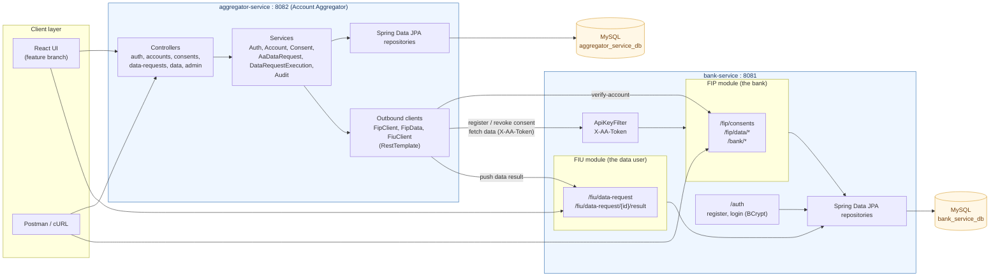

**Design notes**

- The AA is deliberately **not** the data owner. It brokers consent and routes requests, while customer financial data lives in the FIP's database.
- The FIP is the **last line of defence**. Even if the AA were compromised or buggy, the FIP independently validates the consent artefact before releasing data.
- Each service owns its own schema and its own consent record. The AA holds the customer-facing consent, and the FIP holds the artefact it enforces.

### Layered view of `aggregator-service`

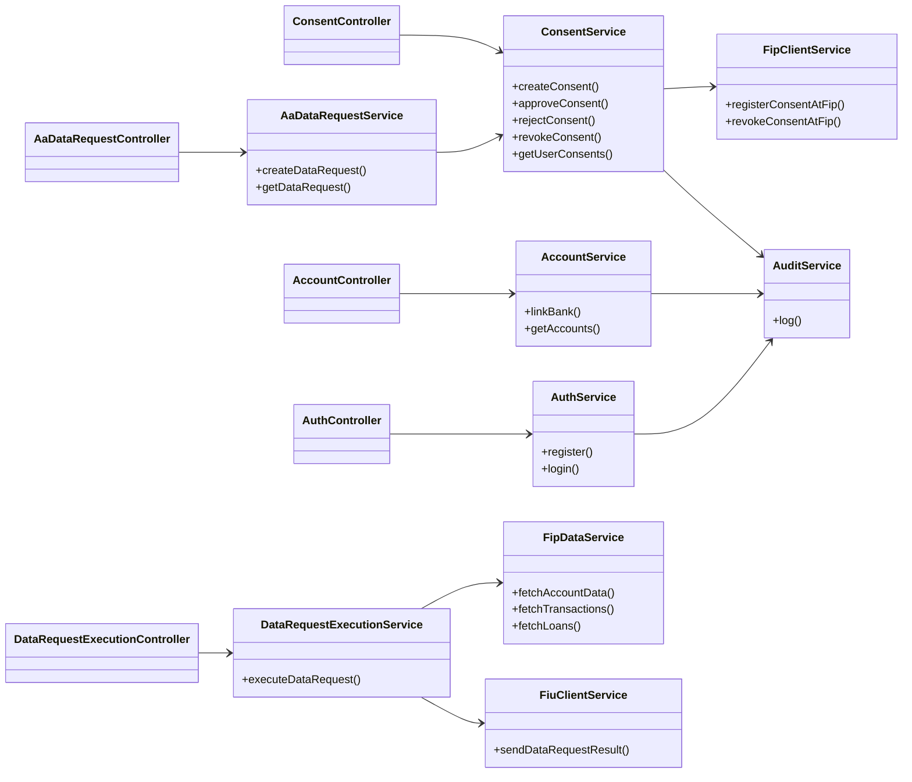

---

## 🔄 End-to-End Flows

### 1. Onboarding and bank linking

The customer registers with the AA, then links a bank account. The AA never sees the bank's data directly. It asks the FIP to verify the customer's net-banking credentials and stores only the verified linkage.

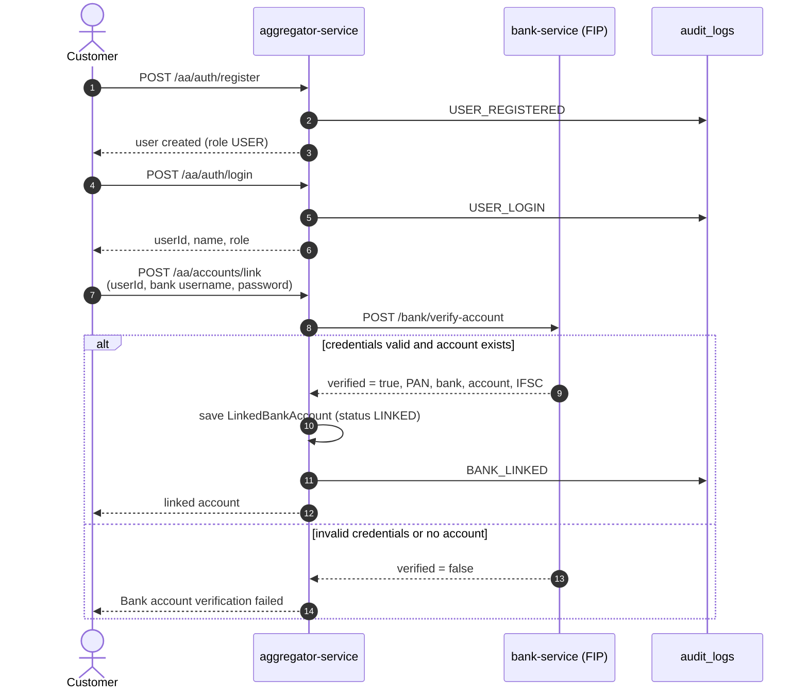

### 2. Consent request → approval → data delivery

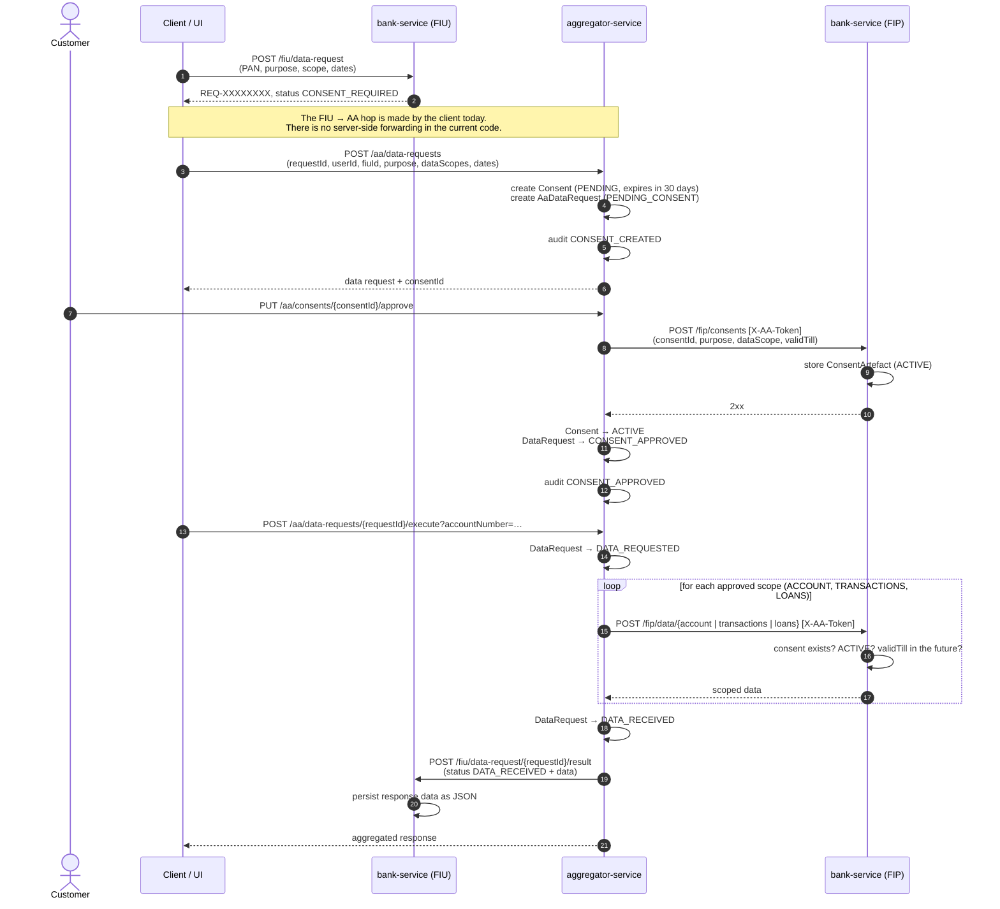

### 3. Rejection and revocation

Consent decisions are never one-sided. The AA changes its own state **only after** the FIP has accepted the change.

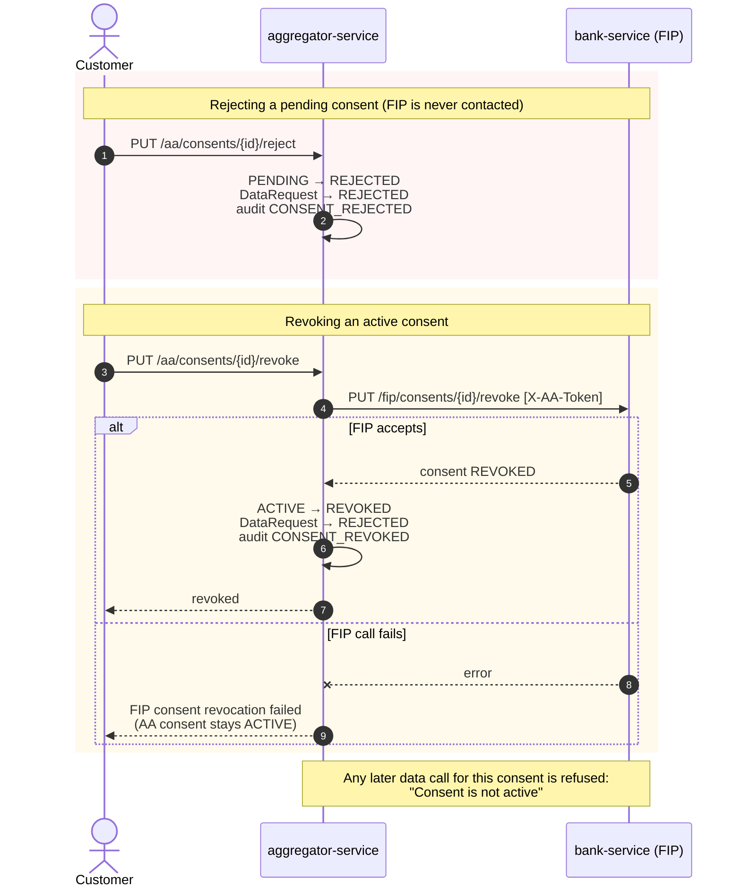

---

## 🧭 Lifecycles and State Machines

### Consent (aggregator-service)

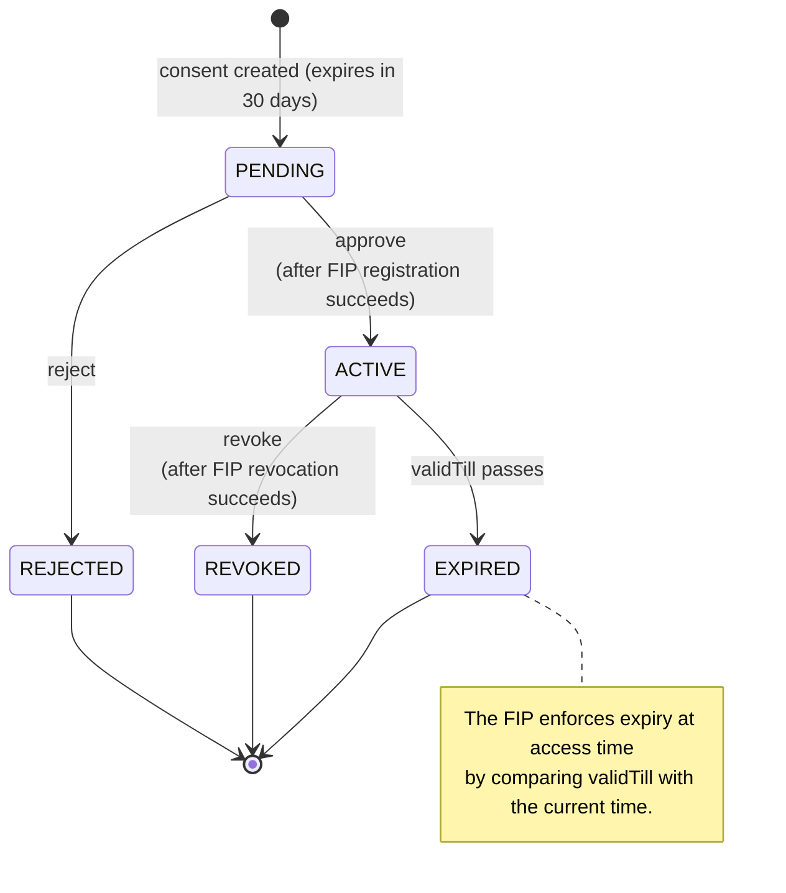

### Data request (aggregator-service)

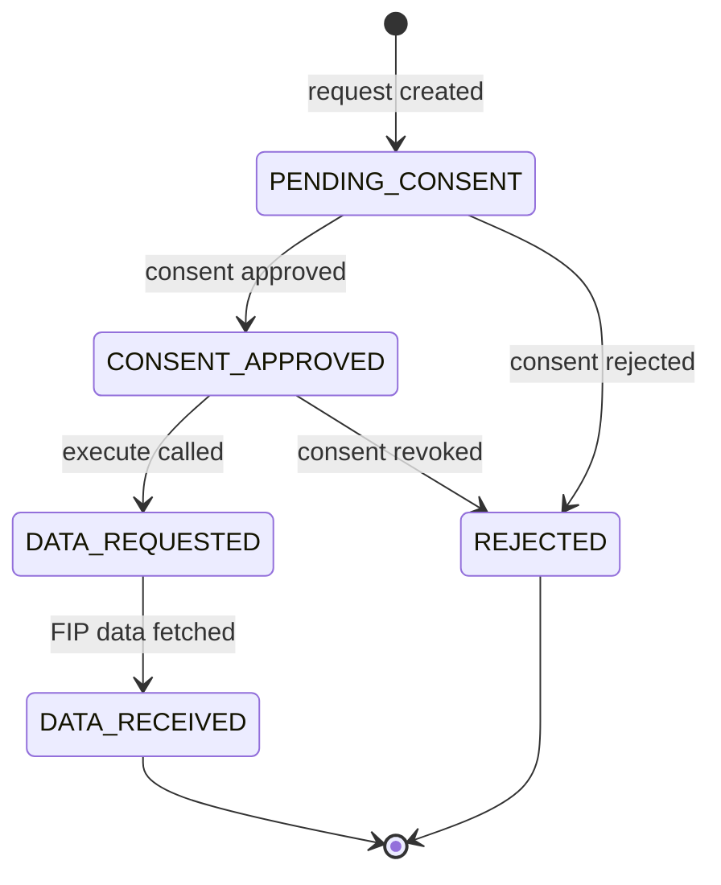

### Consent artefact (bank-service / FIP)

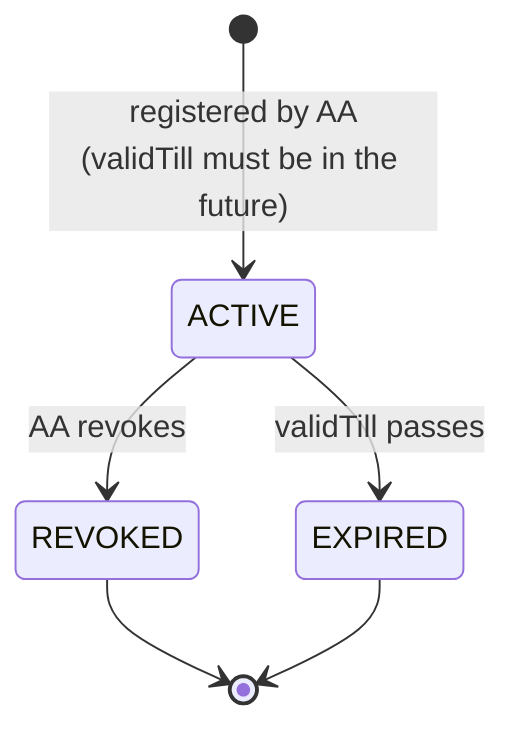

### FIU data request (bank-service / FIU)

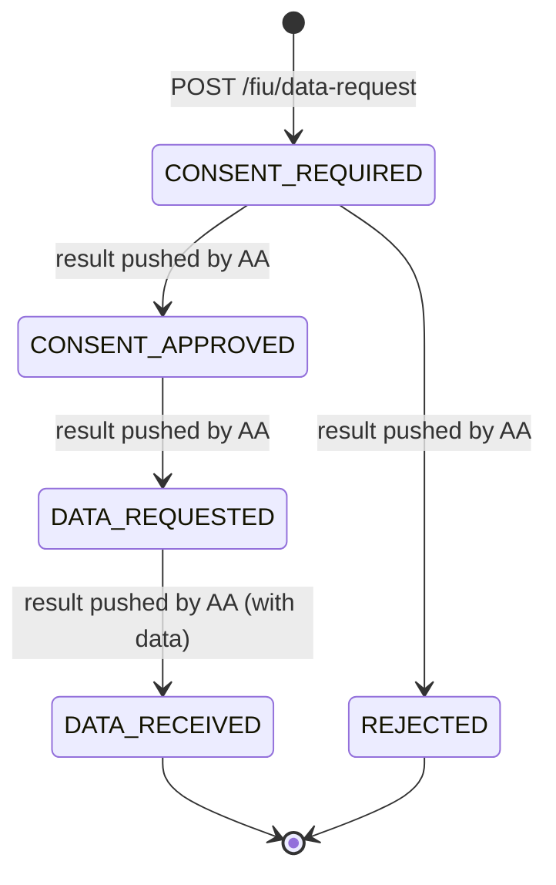

> The FIU accepts any valid `RequestStatus` from the AA's result callback, so the transitions above show the statuses the AA actually reports.

---

## 🗄 Data Model

### `aggregator-service`: schema `aggregator_service_db`

Tables are created and updated by Hibernate from the JPA entities (`ddl-auto: update`).

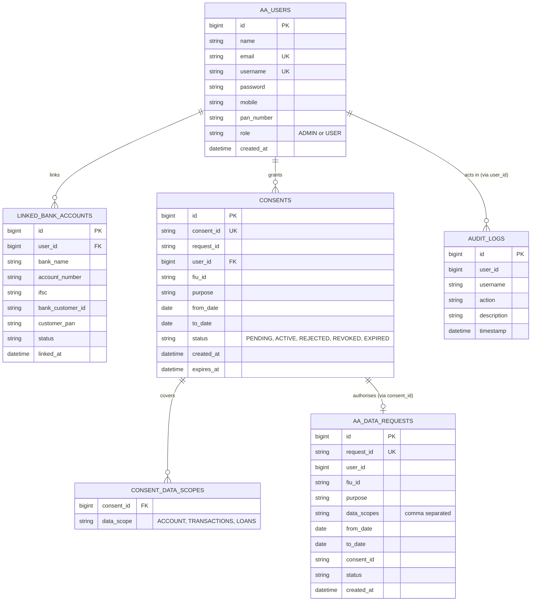

### `bank-service`: schema `bank_service_db`

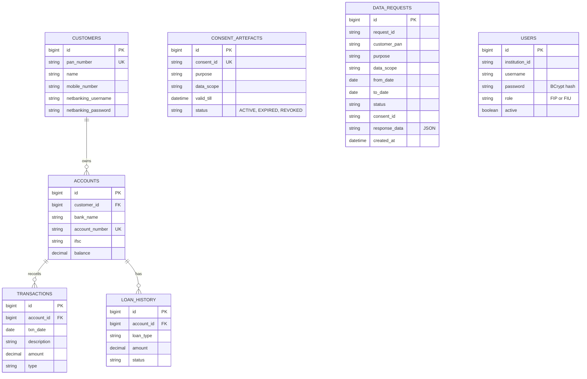

`consent_artefacts`, `data_requests` and `users` are standalone: they are linked to the rest by business identifiers (`consent_id`, `customer_pan`), not by foreign keys.

---

## 🔬 Service Internals

### `aggregator-service` (port 8082)

| Component | Responsibility |
|---|---|
| `AuthService` | Register customers (always role `USER`), log in, write audit entries |
| `AccountService` | Call the FIP's `/bank/verify-account`, prevent duplicate links, store `LinkedBankAccount` |
| `AaDataRequestService` | Validate a new data request, create the paired `Consent` (`PENDING`) and `AaDataRequest` (`PENDING_CONSENT`) |
| `ConsentService` | Own the consent state machine. FIP is contacted **before** local state changes on approve and revoke |
| `DataRequestExecutionService` | Require `CONSENT_APPROVED`, fetch only the approved scopes, mark `DATA_RECEIVED`, notify the FIU |
| `FipClientService` | `POST /fip/consents` and `PUT /fip/consents/{id}/revoke` with `X-AA-Token` |
| `FipDataService` | `POST /fip/data/account`, `/transactions`, `/loans` with `X-AA-Token` |
| `FiuClientService` | `POST /fiu/data-request/{id}/result` back to the FIU |
| `AuditService` | Persist an `AuditLog` row (user, action, description, timestamp) |

### `bank-service` (port 8081)

| Component | Responsibility |
|---|---|
| `ApiKeyFilter` | Requires a matching `X-AA-Token` on `/bank/validate-consent`, `/bank/fetch-data`, `/bank/fetch-statement`, `/bank/loan-history`, `/fip/consents*`, `/fip/data/*`. Missing or wrong key → `401` |
| `FipConsentService` | Register a consent artefact (`ACTIVE`, future `validTill`, no duplicates) and revoke it |
| `FipDataService` | Validate the consent on every call, then return account, transaction or loan data |
| `BankController` | Health check, direct consent validation, Base64-encoded account snapshot, statements, loan history, account verification |
| `FiuDataRequestService` | Create a data request (`REQ-XXXXXXXX`, `CONSENT_REQUIRED`), receive and store results from the AA |
| `AuthService` | Register and log in FIP / FIU institution users, passwords stored with BCrypt |

---

## 📡 API Reference

All bodies are JSON unless noted. 🔒 means the call requires the `X-AA-Token` header.

### Aggregator Service: `http://localhost:8082`

| Method | Endpoint | Purpose |
|---|---|---|
| `POST` | `/aa/auth/register` | Register a customer |
| `POST` | `/aa/auth/login` | Log in |
| `POST` | `/aa/accounts/link` | Verify and link a bank account via the FIP |
| `GET` | `/aa/accounts/{userId}` | List a customer's linked accounts |
| `POST` | `/aa/data-requests` | Create a data request and its pending consent |
| `GET` | `/aa/data-requests/{requestId}` | Fetch a data request |
| `POST` | `/aa/data-requests/{requestId}/execute?accountNumber=` | Fetch data from the FIP for an approved request and notify the FIU |
| `POST` | `/aa/consents` | Create a consent directly |
| `GET` | `/aa/consents/user/{userId}` | List a customer's consents |
| `GET` | `/aa/consents/{consentId}` | Fetch one consent |
| `PUT` | `/aa/consents/{consentId}/approve` | Approve (registers at the FIP first) |
| `PUT` | `/aa/consents/{consentId}/reject` | Reject a pending consent |
| `PUT` | `/aa/consents/{consentId}/revoke` | Revoke an active consent (revokes at the FIP first) |
| `POST` | `/aa/data/account` · `/aa/data/transactions` · `/aa/data/loans` | Proxy a scoped fetch to the FIP (`accountNumber`, `consentId` query params) |
| `GET` | `/aa/admin/users` · `/accounts` · `/consents` · `/audit-logs` | Admin listings |

**Create a data request**

```json
POST /aa/data-requests
{
  "requestId": "REQ-1A2B3C4D",
  "userId": 1,
  "fiuId": "FIU-001",
  "purpose": "Loan Application",
  "dataScopes": ["ACCOUNT", "TRANSACTIONS", "LOANS"],
  "fromDate": "2026-01-01",
  "toDate": "2026-06-30"
}
```

### Bank Service: `http://localhost:8081`

**FIP / bank endpoints**

| Method | Endpoint | Auth | Purpose |
|---|---|---|---|
| `GET` | `/bank/health-check` | none | Liveness |
| `POST` | `/bank/verify-account` | none | Verify net-banking credentials and return the linked account |
| `POST` | `/bank/validate-consent` | 🔒 | Check a consent is `ACTIVE` and unexpired |
| `POST` | `/bank/fetch-data?accountNumber=&consentId=` | 🔒 | Account snapshot, Base64-encoded |
| `POST` | `/bank/fetch-statement?accountNumber=&consentId=&fromDate=&toDate=` | 🔒 | Transactions, optional date range |
| `GET` | `/bank/loan-history/{accountNumber}` | 🔒 | Loan history |
| `POST` | `/fip/consents` | 🔒 | Register a consent artefact |
| `PUT` | `/fip/consents/{consentId}/revoke` | 🔒 | Revoke a consent artefact |
| `POST` | `/fip/data/account` · `/transactions` · `/loans` | 🔒 | Consent-validated data release (`accountNumber`, `consentId`) |

**FIU endpoints**

| Method | Endpoint | Purpose |
|---|---|---|
| `POST` | `/fiu/data-request` | Create a request (`customerPan`, `purpose`, `dataScope`, `fromDate`, `toDate` are required) |
| `GET` | `/fiu/data-request/{requestId}` | Read a request and any delivered data |
| `POST` | `/fiu/data-request/{requestId}/result` | Callback used by the AA to deliver status and data |

**Institution auth**

| Method | Endpoint | Purpose |
|---|---|---|
| `POST` | `/auth/register` | Register a FIP / FIU institution user |
| `POST` | `/auth/login` | Log in |

**Status codes on `/bank/*` consent checks**

| Code | Meaning |
|---|---|
| `200` | Success |
| `400` | Consent expired or revoked |
| `401` | Missing or invalid `X-AA-Token` |
| `403` | Consent invalid, data not shared |
| `404` | Consent not found |

Detailed request and response shapes for the original `/bank/*` endpoints are in [`docs/api-contracts.md`](docs/api-contracts.md).

---

## 🔐 Security Model

Honest status of what is enforced today and what is planned. This is a reference implementation, and the table is meant to make its boundaries clear.

| Area | Status | Details |
|---|---|---|
| Consent enforcement at the FIP | ✅ Implemented | Existence, `ACTIVE` status and `validTill` are checked on every data call |
| AA → FIP authentication | ✅ Implemented | Shared secret in `X-AA-Token`, enforced by `ApiKeyFilter` |
| Institution password storage (`bank-service /auth`) | ✅ Implemented | BCrypt via `spring-security-crypto` |
| Atomic consent changes across services | ✅ Implemented | FIP is updated first, AA state changes only on success |
| Customer password storage (`aggregator-service`) | ⚠️ Plaintext | Needs BCrypt before any real use |
| Session / token auth on AA endpoints | ⚠️ Not yet | No JWT or Spring Security in `aggregator-service`; `/aa/**` is open |
| Role enforcement on `/aa/admin/**` | ⚠️ Not yet | Admin listings are unauthenticated and return full entities |
| FIU callback authentication | ⚠️ Not yet | `/fiu/**` has no API-key check |
| Payload protection | ⚠️ Simulated | `/bank/fetch-data` uses **Base64 encoding**, which is an encoding, not encryption |
| Secrets management | ⚠️ In config | DB credentials and the API key are committed in `application.yml`; override them with environment variables |
| Transport security | ⚠️ HTTP | Local development uses plain HTTP; use TLS in any shared environment |

---

## ⛓ Audit Trail and Hash-Chain Ledger

**Live today.** Every important action is written to the append-only `audit_logs` table by `AuditService`:

`USER_REGISTERED` · `USER_LOGIN` · `BANK_LINKED` · `CONSENT_CREATED` · `CONSENT_APPROVED` · `CONSENT_REJECTED` · `CONSENT_REVOKED`

Entries can be read through `GET /aa/admin/audit-logs`.

**Planned.** The ledger that gives the project its name. The `audit_blocks` table (`event`, `data`, `timestamp`, `hash`, `previous_hash`) is defined in `docs/databaseScripts/aggregator_table_scheme.sql`, but the hashing and chaining logic is not implemented in the services yet. The intended design:

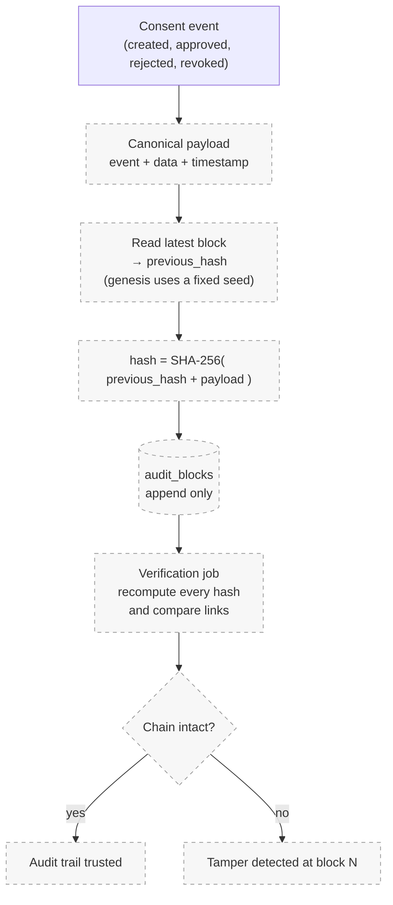

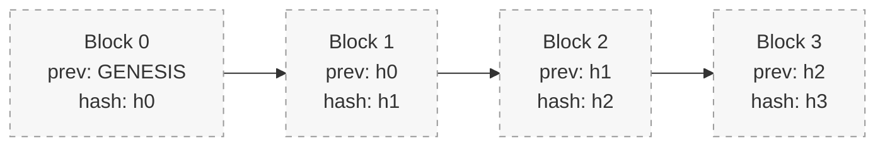

Changing any past block changes its hash, which breaks every later `previous_hash` link, so tampering becomes detectable. This is an enhancement layered **on top of** the AA framework: RBI's AA specification does not require a blockchain.

---

## 🧰 Tech Stack

| Layer | Technology |
|---|---|
| Language / runtime | Java 21 |
| Framework | Spring Boot 3.3.4 (Spring Web, Spring Data JPA, Bean Validation in `bank-service`) |
| Persistence | Hibernate / JPA, MySQL (Connector/J) |
| Service-to-service HTTP | Spring `RestTemplate` |
| Password hashing | `spring-security-crypto` (BCrypt) in `bank-service` |
| Boilerplate | Lombok |
| Build | Maven (wrapper included in both services) |
| Frontend (feature branch) | React 19, Vite 8, Tailwind CSS 3, React Router 7, react-icons |

---

## 🚀 Getting Started

### Prerequisites

- JDK **21**
- MySQL **8** running on `localhost:3306`
- Git

### 1. Clone

=======
A blockchain-based reference implementation of RBI's Account Aggregator (AA) framework for secure, consent-driven financial data sharing.

## Project Structure

```
consent-chain/
├── bank-service/              → Bank / FIP (Financial Information Provider) simulation
├── aggregator-service/        → Account Aggregator + Blockchain audit layer
├── frontend-consent-dashboard/→ React UI (Consent management + dashboard)
├── docs/                      → Architecture diagrams, API contracts
└── README.md sakshi
```

## Team & Responsibilities

| Member  | Module | Responsibility |
|---------|---|---|
| Sakshi  | `bank-service` | Bank/FIP simulation — validate consent, fetch & encrypt account data |
| Bhunesh | `aggregator-service` | Account Aggregator logic, consent broker, blockchain ledger, revocation |
| [Name]  | `frontend-consent-dashboard` | React UI — consent grant/view/revoke, dashboard, audit log view |

**Current working approach:** Sakshi and Bhunesh are pairing on `bank-service` first (build shared understanding, move faster), before splitting off to `aggregator-service` work.

## Tech Stack

- **Backend:** Java 21, Spring Boot 3.3.4, Maven
- **Database:** H2 (in-memory, dev)
- **Frontend:** React
- **Blockchain layer:** Custom hash-chain (SHA-256 based audit trail)

---

<<<<<<< HEAD
## `bank-service` — Overview

Simulates a **Financial Information Provider (FIP)** — i.e., a bank — in the RBI Account Aggregator framework. Provides account data, validates consent, and simulates encrypted data sharing with the Account Aggregator.
=======
### Progress So Far

- [x] Repository structure set up (3 module folders + docs)
- [x] Spring Boot project initialized — Java 21, Maven, dependencies: Web, Data JPA, H2, Lombok
- [x] `application.yml` configured — H2 in-memory DB, H2 console enabled, server running on **port 8081**
- [x] Health check endpoint working: `GET /bank/health-check`
- [x] `BankAccount` entity model created (id, accountNumber, ifscCode, holderName, balance)
- [x] Repository layer, seed data, ConsentArtefact model, validate-consent + fetch-data endpoints, and API contract doc completed

### Task Breakdown (In Order)

#### 1. Repository Layer
Create `BankAccountRepository` extending `JpaRepository`.
```java
public interface BankAccountRepository extends JpaRepository<BankAccount, Long> {
    Optional<BankAccount> findByAccountNumber(String accountNumber);
}
```
**Learn:** JpaRepository, `Optional`
**Status:** [x] Done

#### 2. Seed Data
Add 2-3 dummy bank accounts on startup using `CommandLineRunner`, so there's data to test against.
**Learn:** `CommandLineRunner`, `@Component`
**Status:** [x] Done

#### 3. ConsentArtefact Model
Define the structure of a consent record: `consentId`, `purpose`, `dataScope`, `validTill`, `status` (ACTIVE / EXPIRED / REVOKED)
**Learn:** `LocalDateTime`, entity design
**Status:** [x] Done — `ConsentArtefactRepository` also added

#### 4. Validate Consent Endpoint
`POST /bank/validate-consent` — checks if a consent artefact is still valid (status = ACTIVE and not expired).
**Learn:** `@RequestBody`, `ResponseEntity`
**Status:** [x] Done

#### 5. Fetch Data Endpoint
`POST /bank/fetch-data` — returns account data if consent is valid.
**Learn:** `@RequestParam`, exception handling (`orElseThrow`)
**Status:** [x] Done — combined with encoding step (see #6)

#### 6. Encrypt & Send
Simple encoding (Base64 for now, not full encryption) to simulate secure data transfer to the aggregator.
**Learn:** Base64 encoding basics
**Status:** [x] Done — implemented inside `/bank/fetch-data`

#### 7. Share API Contract
Once endpoints 4-6 are working, document exact request/response JSON shapes in `docs/api-contracts.md` and share with the aggregator-service dev, so integration can begin without waiting for full completion.
**Status:** [x] Done — see `docs/api-contracts.md`

#### 8. Basic Logging
Add simple logs (e.g. `System.out.println` or `Slf4j`) for each request — will feed into the audit trail later.
**Status:** [ ] Not started

#### 9. Unit Tests
Basic tests for validation logic (consent expiry, invalid status, etc.)
**Status:** [ ] Not started

## How to Run (bank-service)
>>>>>>> feature/bank-service

### How to Run
>>>>>>> efe59f5c22482c0cc6cae41be352ed9a8b0180cc
```bash
git clone https://github.com/sakshi048/consent-chain.git
cd consent-chain
```

### 2. Prepare the databases

**Bank service.** Create the schema and load demo customers, accounts, transactions, loans and a sample consent artefact:

```bash
mysql -u root -p < docs/databaseScripts/bank_service_table_scheme.sql
mysql -u root -p < docs/databaseScripts/bank_data_seed.sql
```

The `users` and `data_requests` tables are created by Hibernate on first start.

**Aggregator service.** Only the database itself is needed. Hibernate creates the tables from the entities:

```bash
mysql -u root -p -e "CREATE DATABASE IF NOT EXISTS aggregator_service_db;"
```

> `aggregator_table_scheme.sql` and `aggregator_data_seed.sql` describe an earlier table design (`consent_artefacts`, `institutions`, `audit_blocks`, …). Most of those tables are not used by the current entities, so they are optional.

### 3. Set the runtime configuration

The committed `application.yml` files contain development defaults. Override them with environment variables instead of editing the files:

```bash
# Bank service (terminal 1)
export SPRING_DATASOURCE_URL=jdbc:mysql://localhost:3306/bank_service_db
export SPRING_DATASOURCE_USERNAME=root
export SPRING_DATASOURCE_PASSWORD=<your-mysql-password>
export BANK_AA_API_KEY=<shared-secret>
```

```bash
# Aggregator service (terminal 2)
export SPRING_DATASOURCE_USERNAME=root
export SPRING_DATASOURCE_PASSWORD=<your-mysql-password>
export FIP_AA_API_KEY=<shared-secret>          # must equal BANK_AA_API_KEY
export FIU_BASE_URL=http://localhost:8081      # required, see note below
```

> **Required property.** `FiuClientService` reads `fiu.base-url`, which is not defined in the committed `aggregator-service/src/main/resources/application.yml`. Without `FIU_BASE_URL` (or adding `fiu.base-url: http://localhost:8081` to the file) the aggregator fails to start. The FIU module lives inside `bank-service`, so it points at port 8081.

The bank service's committed datasource URL points at `consentchain_auth`, whereas the SQL scripts create `bank_service_db`. Setting `SPRING_DATASOURCE_URL` as above keeps them aligned.

### 4. Run

```bash
# Terminal 1: FIP + FIU on :8081
cd bank-service
./mvnw spring-boot:run
```
<<<<<<< HEAD

=======
- App runs on: `http://localhost:8081`
- H2 console: `http://localhost:8081/h2-console` (JDBC URL: `jdbc:h2:mem:bankdb`)

### Progress So Far

- [x] Repo structure set up (3 module folders + docs)
- [x] Spring Boot project initialized — Java 21, Maven, dependencies: Web, Data JPA, H2, Lombok
- [x] `application.yml` configured — H2 in-memory DB, H2 console enabled, server running on **port 8081**
- [x] Health check endpoint working: `GET /bank/health-check`
- [x] `BankAccount` entity model created (id, accountNumber, ifscCode, holderName, balance)

### Task Breakdown (In Order)

#### 1. Repository Layer
Create `BankAccountRepository` extending `JpaRepository`.
```java
public interface BankAccountRepository extends JpaRepository<BankAccount, Long> {
    Optional<BankAccount> findByAccountNumber(String accountNumber);
}
```
**Learn:** JpaRepository, `Optional`
**Status:** [ ] Not started

#### 2. Seed Data
Add 2-3 dummy bank accounts on startup using `CommandLineRunner`, so there's data to test against.
**Learn:** `CommandLineRunner`, `@Component`
**Status:** [ ] Not started

#### 3. ConsentArtefact Model
Define the structure of a consent record: `consentId`, `purpose`, `dataScope`, `validTill`, `status` (ACTIVE / EXPIRED / REVOKED)
**Learn:** `LocalDateTime`, entity design
**Status:** [ ] Not started

#### 4. Validate Consent Endpoint
`POST /bank/validate-consent` — checks if a consent artefact is still valid (status = ACTIVE and not expired).
**Learn:** `@RequestBody`, `ResponseEntity`
**Status:** [ ] Not started

#### 5. Fetch Data Endpoint
`POST /bank/fetch-data` — returns account data if consent is valid.
**Learn:** `@RequestParam`, exception handling (`orElseThrow`)
**Status:** [ ] Not started

#### 6. Encrypt & Send
Simple encoding (Base64 for now, not full encryption) to simulate secure data transfer to the aggregator.
**Learn:** Base64 encoding basics
**Status:** [ ] Not started

#### 7. Share API Contract
Once endpoints 4-6 are working, document exact request/response JSON shapes in `docs/api-contracts.md` and share with the aggregator-service dev, so integration can begin without waiting for full completion.
**Status:** [ ] Not started

#### 8. Basic Logging
Add simple logs (e.g. `System.out.println` or `Slf4j`) for each request — will feed into the audit trail later.
**Status:** [ ] Not started

#### 9. Unit Tests
Basic tests for validation logic (consent expiry, invalid status, etc.)
**Status:** [ ] Not started

### What to Learn Along the Way

| Concept | Why it matters |
|---|---|
| JPA Repository pattern | Core to how every entity is queried/saved |
| REST annotations (`@GetMapping`, `@PostMapping`, `@RequestBody`, `@RequestParam`) | Building blocks for every endpoint |
| `ResponseEntity` + status codes | Proper API responses (200, 400, 404, etc.) |
| `CommandLineRunner` | Seeding test data on startup |
| Exception handling basics | Graceful error responses instead of crashes |
| Base64 encoding | Simulating secure data transfer (not real encryption, but demonstrates the concept) |

---

## `aggregator-service` — Overview

Account Aggregator (consent broker) + custom blockchain hash-chain for immutable audit trail.

### How to Run
>>>>>>> efe59f5c22482c0cc6cae41be352ed9a8b0180cc
```bash
# Terminal 2: Account Aggregator on :8082
cd aggregator-service
./mvnw spring-boot:run
```
<<<<<<< HEAD
=======
- App runs on: `http://localhost:8082`
- H2 console: `http://localhost:8082/h2-console` (JDBC URL: `jdbc:h2:mem:aggregatordb`)

### Progress So Far

- [x] Spring Boot project initialized — Java 21, Maven, dependencies: Web, Data JPA, H2, Lombok
- [x] `application.yml` configured — port `8082`
- [x] Health check endpoint working: `GET /aggregator/health-check`

### Next Steps (after bank-service basics are done)

- [ ] `ConsentArtefact` model (mirrors bank-service structure)
- [ ] SHA-256 hash utility (`MessageDigest`)
- [ ] Blockchain ledger entity (hash + previousHash + timestamp)
- [ ] Consent validation/routing logic
- [ ] Revocation service + session invalidation
>>>>>>> efe59f5c22482c0cc6cae41be352ed9a8b0180cc

### 5. Smoke test

<<<<<<< HEAD
```bash
curl http://localhost:8081/bank/health-check
# → Bank service is up

# FIP rejects calls without the shared secret
curl -i -X POST "http://localhost:8081/bank/validate-consent" \
     -H "Content-Type: application/json" \
     -d '{"consentId":"x"}'
# → 401 Unauthorized

# Register a customer at the AA
curl -X POST http://localhost:8082/aa/auth/register \
     -H "Content-Type: application/json" \
     -d '{"name":"Demo User","email":"demo@example.com","username":"demo","password":"demo@123","mobile":"9999999999","panNumber":"ABCPL1234D"}'
```

Then follow the [consent flow](#2-consent-request--approval--data-delivery): link a bank account, create a data request, approve the consent, and execute the request.

### Optional: frontend (feature branch)

The React UI lives on `feature/frontend-and-setup` and has not been merged into `main`.

```bash
git checkout feature/frontend-and-setup
cd frontend
npm install
npm run dev
```

---

## ⚙ Configuration

| Service | Property | Default in repo | Environment override |
|---|---|---|---|
| both | `spring.datasource.url` | aggregator: `jdbc:mysql://localhost:3306/aggregator_service_db`, bank: `…/consentchain_auth` | `SPRING_DATASOURCE_URL` |
| both | `spring.datasource.username` / `password` | `root` / development value | `SPRING_DATASOURCE_USERNAME` / `SPRING_DATASOURCE_PASSWORD` |
| both | `spring.jpa.hibernate.ddl-auto` | `update` | `SPRING_JPA_HIBERNATE_DDL_AUTO` |
| bank | `server.port` | `8081` | `SERVER_PORT` |
| bank | `bank.aa-api-key` | development value | `BANK_AA_API_KEY` |
| aggregator | `server.port` | `8082` | `SERVER_PORT` |
| aggregator | `fip.base-url` | `http://localhost:8081` | `FIP_BASE_URL` |
| aggregator | `fip.aa-api-key` | development value | `FIP_AA_API_KEY` |
| aggregator | `fiu.base-url` | **not set**, must be provided | `FIU_BASE_URL` |

The two API keys must match, otherwise every AA → FIP call is rejected with `401`.

---

## 📁 Repository Layout

```text
consent-chain/
├── aggregator-service/                  # Account Aggregator (port 8082)
│   └── src/main/java/com/consentchain/aggregatorservice/
│       ├── controller/                  # auth, accounts, consents, data-requests, data, admin
│       ├── service/                     # consent state machine, execution, FIP/FIU clients, audit
│       ├── model/                       # entities and status enums
│       ├── repository/                  # Spring Data JPA
│       ├── dto/                         # request / response objects
│       └── config/                      # RestTemplate bean
├── bank-service/                        # FIP + FIU (port 8081)
│   └── src/main/java/com/consentchain/bankservice/
│       ├── controller/                  # bank, fip consents, fip data, fiu, auth
│       ├── service/                     # consent registry, data release, FIU requests, auth
│       ├── filter/                      # ApiKeyFilter (X-AA-Token)
│       ├── model/                       # customers, accounts, transactions, loans, artefacts
│       ├── repository/
│       ├── dto/
│       └── config/                      # BCrypt password encoder
├── docs/
│   ├── api-contracts.md                 # bank endpoint contracts
│   ├── Account Aggregator System Flow Infographic.png
│   ├── databaseScripts/                 # schema + seed SQL, database specification
│   └── readmeFiles/CHANGELOG.md         # development log
└── README.md
```

---

## 🗺 Project Status and Roadmap

### Delivered

- [x] FIP: consent registry, consent-validated data release, statements, loan history, account verification
- [x] FIU: request creation and result callback storage
- [x] AA: registration, login, bank linking, consent create / approve / reject / revoke, data request execution
- [x] Cross-service consent sync with fail-safe ordering
- [x] `X-AA-Token` protection on all FIP data and consent endpoints
- [x] `audit_logs` trail for user and consent events
- [x] MySQL schemas and demo seed data

### In progress

- [ ] React dashboard: customer, FIP and FIU screens exist on `feature/frontend-and-setup` and need to be wired to the AA endpoints and merged to `main`

### Next

- [ ] **SHA-256 hash-chained ledger** (`audit_blocks`) with a chain-verification endpoint
- [ ] JWT authentication and role-based authorisation for `/aa/**`, including `/aa/admin/**`
- [ ] BCrypt for AA customer passwords
- [ ] Server-side FIU → AA request forwarding
- [ ] Scheduled consent expiry (`EXPIRED`) at the AA
- [ ] Real payload encryption to replace Base64
- [ ] Global exception handling with typed errors and consistent status codes
- [ ] Unit and integration tests for consent validation, expiry and revocation
- [ ] Externalised secrets and Dockerised local setup

---

<div align="center">

**ConsentChain** · Java 21 · Spring Boot 3.3.4 · MySQL

Repository: [`sakshi048/consent-chain`](https://github.com/sakshi048/consent-chain)

</div>
=======
## Setup Notes for Contributors

- Clone the repo, create your module folder under the project root (already scaffolded)
- Use **Java 21** consistently across all backend modules
- Keep `.idea/` out of commits — it's in `.gitignore`
- Branch naming: `feature/<your-module>` → PR into `main` when ready
- Keep seed data logic separate from controllers (own file, e.g. `DataSeeder.java`)
- Endpoint naming convention: `/bank/<action>`, `/aggregator/<action>`
- Commit small, working increments — don't wait to finish everything before pushing
>>>>>>> efe59f5c22482c0cc6cae41be352ed9a8b0180cc
